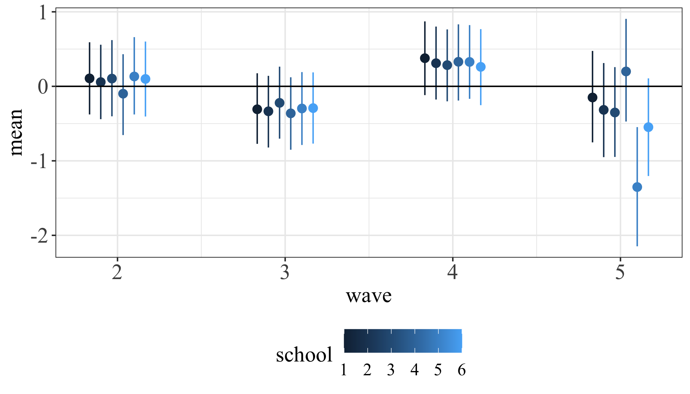
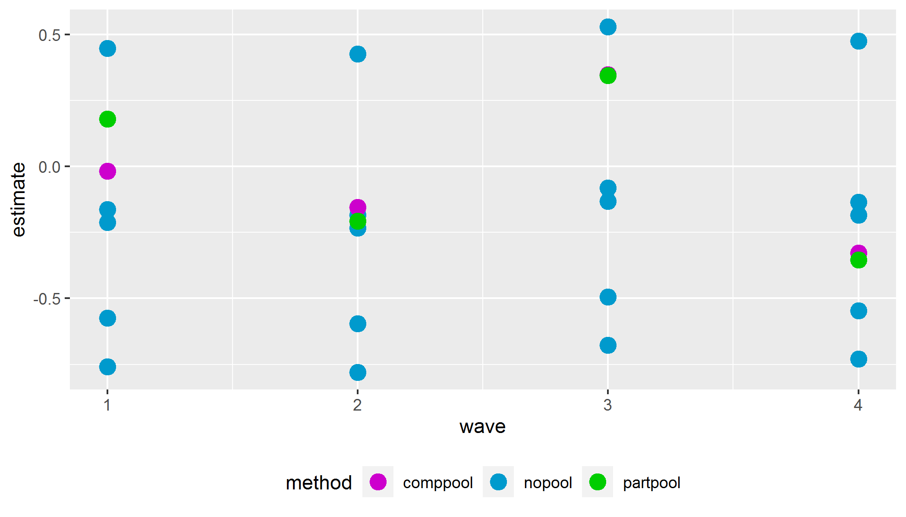

```{r setup, include=FALSE}
knitr::opts_chunk$set(echo = TRUE, concordance = TRUE)
library(summarytools)
library(kableExtra)
library(stargazer)
```

<!-- TITLE PAGE -->

\begin{titlepage}
% Titlepage (fold)
\thispagestyle{empty}%
\begin{center}
\renewcommand{\baselinestretch}{1.0}\normalsize %
\textbf{
The effect of music education on students' well-being. Empirical evidence from a field experiment}\\[1cm]
Preliminary - work in progress \\[1cm]
This draft: \today \\[1cm]
% Comments welcome \\[0.25cm]
% \renewcommand{\baselinestretch}{1.5}\normalsize
Vera Schramm \\
University of Halle-Wittenberg \\[0.75cm]
% \today
 \end{center}


\end{titlepage}

<!-- ABSTRACT -->

 \renewcommand{\baselinestretch}{1}\normalsize

 \textbf{\normalsize Abstract}
Our analyses, following the discussion above, address two central questions
using a cultural capital framework. First, who participates in music
both in and outside of school, and to what extent is such involvement
stratified by social class, race/ethnic, and gender status? Second, and relative
to the more central question discussed at the outset, do various forms of
music involvement influence academic achievement, even after accounting
for prior achievement, background statuses, and other educationally meaningful
investments? Relatedly, to what extent might disparities in music
involvement shape group-specific gaps in achievement that have been so well
documented elsewhere?

<!--  \pagenumbering{roman} -->
<!-- \setcounter{page}{2} -->

<!-- TOC -->

\clearpage
\tableofcontents

<!-- BODY -->

<!-- \pagenumbering{arabic} -->
\clearpage
\doublespacing
\pagestyle{plain}
<!-- \setcounter{page}{1} -->

<!-- INTRODUCTION -->

# Introduction
\label{sec:introduction}

In German schools, and music are often considered less important than the typical hard subjects like math and science. Due to a lack of teachers, many classes are cancelled, of which 80\% are in the subject of music. In Saxony we see ongoing efforts to eliminate the subject of music from the curriculum entirely. Furthermore, the quality of music lessons suffers from the fact that 80\% of its teaching staff are foreign to the subject [@Moeller2017].

Music education experts are concerned about this development. According to them, music should not be regarded as a private matter. Regardless of their socioeconomic background, school children must have the opportunity to receive high level music education because it is as important for a proper education as literacy and mathematics [@Gebert2018]. Prof. Höppner, the General Secretary of the German Music Council (Generalsekretär des Deutschen Musikrats), said in an interview that music education helps to build stable self-esteem by learning to access ones own emotions [@Stoverock]. He points out that the phase where music can shape a young person explicitly well is completed by the age of 13. That stresses the importance of high quality music education for students in pre- and secondary school.

The Federal Association of Music Education (Bundesverband Musikunterricht (BMU)) has set up the "Agenda 2030" to initiate an improvement in music education. Similar to Höppner [@Stoverock], they consider music education as valuable and essential for a social and cultural society. It encourages children to take responsibility and to increase their sense of self-determination [@BundesverbandMusikunterricht, p. 2].

In views of this broad societal debate, empirical research has concentrated on the effect of music education on cognitive abilities (school grades and IQ in particular). Not so much effort was spent on observing the connection of music and well-being. This seems surprising because life satisfaction and happiness have become central research areas in the social sciences. My thesis addresses this research gap and investigates the effects of music education on children's overall life satisfaction and on satisfaction in specific areas, namely satisfaction with the class, satisfaction with friends, and satisfaction with the situation at school. It analyzes music education in the classroom where fifth and sixth grade students have one additional hour of music education per week. The project is called "klasse.im.puls" and it promotes the establishment of musical training in secondary schools in Bavaria. The program was implemented with the intention to give every child the opportunity to learn how to play an instrument. Additional positive outcomes were expected: an increase in self-confidence and social competence, as well as a reduction in violent behavior ^[For more information:]. The project was supervised by the FAU Erlangen-Nuremberg Music Teaching Departement in collaboration with the Bavarian Ministry of Education.
My analysis focuses on the change in the overall life satisfaction and in satisfaction within specific areas reported by the students over the course of the project. The term of *life satisfaction* refers to a cognitive evaluation of a person's reaction to his or her life in contrast to *affect*, an ongoing emotional reaction. Combined, LS and affect yield subjective well-being [@Diener2009, p. 71]. I will approach the problem by using a multi level model, that accounts for differences on the level of the individual student, on the level of the class and on the school level. I do this by using Bayesian inference...

The interest in life satisfaction as an outcome of the music project stems from the idea that higher values of LS come with many benefits. Among other positive correlates, adolescents reporting very high levels of LS are less likely to be affected by depression, anxiety, negative affect and social stress compared to adolescents with very low life satisfaction. Also, they achieve higher SEAs and demonstrate higher mean scores of school satisfaction [@Proctor2009a, p. 928; @Gilman2006, p. 316]. These results go in line with a study by @Suldo2004 [p. 94] that shows that LS could be a moderating variable in predictions of the development of psycho-pathological behaviors. Low life satisfaction may be an indication for externalizing behavior problems in the future. When life satisfaction is on a higher level, those behavior problems are less likely to occur [@Suldo2004, p. 100] The authors conclude that life satisfaction might operate as a buffer against the development of subsequent externalizing behavior problems "in the face of stressful life events" [@Suldo2004. p. 101]. @Kim2003 add to the discussion that externalizing behavior problems in turn lead to more stressful life events. That reciprocal interrelation of stressful life events and externalizing problems (reported as delinquent behaviors) leads to unhealthy dynamics of increasing stress and behavior problems. If higher LS leads better coping mechanisms with stressful life events, these dependencies could be reduced.
LS is also positively correlated with children having higher measures of self-esteem, internal locus of control, and extraversion [@Huebner1991, 107]. These features help in building a solid foundation for later life. On the other hand, dissatisfaction with life is associated with adolescents having poor mental health (like anxiety and neuroticism) and physical health and being exposed to a higher risk of considering or attempting suicide [@Valois2004, 94; @Huebner1991, 107]. Furthermore, @Zullig2001 [284-185] show that adolescents reporting low levels of overall life satisfaction are more likely to use drugs and alcohol earlier in life and in higher amounts than adolescents with medium or high life satisfaction.

Considering the statement of Höppner, one would expect the project to positively effect students' life satisfaction. Evidence for this relation would lend credibility to the project and support its continuation. It could also stress the importance of music education and signal the Ministry of Culture to keep music education in the curriculum and work on its implementation in federal states alongside Bavaria. However, there will be no in-depth investigation of the analysis of any observations. Describing possible reasons for certain outcomes must be left to music and education experts...

The structure of my thesis is as follows: At first there will be an overview of the current literature on music effecting students' lives. Next, the project and the dataset will be explained. Descriptive statistics are presented alongside a detailed diagnostic on pre-treatment differences in the treatment group compared to the control group. The estimation strategy is presented in chapter four, following the results in the fifth chapter. Finally, chapter six concludes and discusses.


*Gute Einleitung bei @Southgate2009*
<!-- LITERATURE REVIEW -->

# Music
\clearpage
\label{sec:literature_review}
With regard to the effect of music on students' lives, most of the researchers are interested in academic outcomes and intelligence among students who are actively involved in music. Generally, there is the predominant perception of a positive link between music and cognitive abilities. @Osborne2015 [14] observed improved math skills and higher subjective well-being scores in children that were part of a music project. He also found them to have a better self-control over impulsive behavior. @Yang2015 (p. 385),@Wetter2008 (p. 372) , @Hille2014 (p. 62), and @Guhn2019 (p. 316) present evidence that children playing music have better grades at school. But this conclusion is not very meaningful as all of these studies follow a correlational design and do not allow for causal inference.  Nonetheless, the very optimistic and as we will see not quite realistic belief has prevailed that playing music causes children to achieve better results at school. This conclusion needs to be *revised*. In an extensive review of the available evidence concerning associations between music and cognitive abilities, the picture is not so clear any longer [@Schellenberg2013]. Small associations between music training and mathematical ability in correlational and quasi-experimental studies might result from individual differences in general intellectual ability (p. 527). The available evidence simply indicates that high-functioning children (i.e., higher IQ, better performance in school) are more likely than other children to take music lessons and to perform well in mathematics and other tests of cognitive ability (p. 534). This fits with the @Hille2014 study where the outcome difference in cognitive skills between musically active and inactive children reduces greatly when holding constant observable characteristics. An other plausible interpretation of study outcomes that fail to detect a causal relationship comes from @Wetter2008. He points out the possibility that the relationship is explained by affluent parents being more likely to afford music lessons for their child and thus, the socio-economic background may be the cause of higher performance at school. Despite the weakness of the above studies to draw causal inference, there is slight evidence that there may be a causal direction *from* music training *to* cognitive abilities in a study by @Schellenberg2004. He compares two treatment groups who receive piano lesson and voice lesson respectively to a control group in which the children have drama lessons. Random assignment to the different conditions allowed for inference that music lessons caused small increases in cognitive abilities (namely larger increases in full-scale IQ). However, this does not preclude the possibility that high-functioning children are more likely driven to play music. The misconception of music being a predictor for academic achievement is also discussed by @Southgate2009 (p. 17) who states that music is rather a mediator, to some degree, of family background and student status. Results from a meta-analysis, suggest that music training does not reliably enhance children and young adolescents' cognitive or academic skills, and that previous positive findings were probably due to confounding variables, such as placebo effects and lack of random allocation of participants [@Sala2016, p. 64]. The effect size was reduced in studies that applied a proper study design (random allocation of participants to the treatment group and comparison to an active control group). With respect to the mathematical outcomes, the only study comparing a music training to an active control group and with random allocation of the participants to the group [@Mehr2013] found a negative effect size. These considerations are in clear contrast to the popular perception that music training enhances any non-music related cognitive skill.

However positive outcomes due to music could be found outside academics. The Norwegian psychologist and musicologist Even Ruud who in 1978 was the head of the first music therapy training performed extensive studies on music and identity. He states that cultural activities, explicitly music, can "contribute to a feeling of quality of life and the subjective sense of health." (p. 96). In an experimental study by @CostaGiomi2004 a positive causal effect was detected of piano lessons on self-esteem [144] but she did not find an effect on math computation scores. One especially popular project that was conducted to improve children's lives is Venezuela's National Music Education Program "El Sistema". It is a large scale social music education program established by José Abreu in the 1970s. 300,000 children are equipped with instruments every year and receive regular after-school lessons and are playing in orchestras. The initial goal was to prevent children from using drugs and being involved in violence and crime which was successfully achieved. Being in orchestras also enhanced social behavior of the students through greater concern for others and their own well-being [@Uy2012, 13]. However positive effects go far beyond keeping adolescents away from drugs and violence: El sistema teaches the participating students to "reflect and act upon the world in order to transform it" [7]. Playing in an orchestra means joy, motivation, teamwork, the aspiration to success [6]. The students pick up management and organizational skills and responsibility due to many roles and rules that they need to follow to sty in the program[p. 10]. Also, being in an orchestra gives the students the change to conceptualize themselves as part of something much larger and greater (p. 11) and they learn to express greater concern for others' and their well being (p. 13). El Sistema became internationally popular and was replicated in several countries. @Osborne2015 reviewed the outcome of El Sistema inspired projects in Australia and found significantly higher subjective well-being scores in the participating group (p. 14). Students from the music program also had better self-control over impulsive behavior (p. 15). However, other studies come to contrary conclusions and fail to show a significant effect of music participation on well-being, social skills, emotional intelligence or self-esteem [@Schellenberg2011a, p. 190 association; @Portowitz2009, p. 121]. Again, findings are diffuse and therefore interpretation of any results needs to be with caution.

The takeaway from this section is we must be very careful when drawing causal conclusion and we have to adjust the methods.

This paper complements existing literature by using different music indicators and estimation strategies to provide further insight on the relationship between music and education as well as the potential sources of endogeneity.

<!-- DATA -->
\clearpage

# Data
\label{sec:data}
## Pre-treatment differences


## The project
\label{project}
The data come from the years 2012-2014 when KIP was conducted in six different secondary schools (Mittel- und Realschulen) in Nuremberg. Generally, there are different types of implementations of the KIP project (e.g. choir, brass band, string orchestra) among which the rock band model was implemented in all of the schools that are subject to this study. Probably due to parents' and students' music preferences, this type has been the most popular. A school was able to apply for the project if certain criteria were fulfilled. For example, the school had to make sure that there was a full-time music teacher who was qualified to carry out the  project. That person was trained to lead a band class and attended yearly meetings with other music teachers to share experiences. This way, it can be assured that the treatment in each school looked pretty much the same and there were no noteworthy differences in the way the teachers arranged the music lessons in the band classes. Participating schools were supported in acquiring equipment and instruments to implement ensemble music class teaching. In each school was a band class and a control class. The band classes received three music lessons per week, whereas the control classes only received two lessons of regular music education. Music lessons in the treatment classes differed significantly from that in the control group. In the band classes, the teachers had a more practical approach and there was less theoretical music education than in the control group. The three music lessons per week were split into a) Instrumental instructions in small groups, b) ensemble playing, and c) general music education (music theory or history). The latter was similar to how regular music education was implemented in the control group. Thefor not only the amount of music education is higher in the treatment group but also the way that music education is delivered differs a lot from normal music lessons in a way that it is more practical and with better equipment. The students played concerts in regular intervals and were thus able to share what they had learned. In five different points of time, the students were asked to fill in a questionnaire:

wave 1: Beginning of 5th grade (pre-treatment)
wave 2: Mid of 5th grade
wave 3: end of 5th grade
wave 4: mid of 6th grade
wave 6: end of 6th grade

In total, 394 students were observed, however not all of them occur in each wave. Some questions were only asked in wave 1 (i.e. sex) which leads to the problem that there were no information about gender for students who did not attend in the first wave. Only 309 reported their gender in wave 1 which leads to 85 students for whom the gender is "unknown". To not miss all of these observations in regressions including gender, NAs were replaced by a category "unknown". The same was done for the variable of migration background and language spoken at home. An other issue to point out is the comparably low number of observations in wave 5 in school 5. 

Students had to rate their level of life satisfaction on a scale reaching from 0 ("completely unsatisfied) to 10 (completely satisfied) for the question "How satisfied are you with your life overall?"

## selection process (and pre-treatment differences)
The decision who attended the treatment group was made before the entrance to grade 5. Parents could choose to put their child into a music class. Therefore, the experiment is not fully randomized. Children who were already into music in the first place might have been more likely to have chosen the music class. Also the decision can be a a consequence of parental and socio-economic background of the student. To have a better idea of possible differences between the treatment and the control group, I computed standardized mean differences:

The standardized mean differences are not a reason of concern in this setting. For most of the observed variables, there are no notable differences between the treatment group and the control group. However, as already suspected, there are differences in prior musical knowledge. Among the treated, there are relatively more children who have music as a hobby before the project has even started. Of the 87 students who answered with "yes" to the question if music was their hobby, only 24 were assigned to the control group and the remaining 63 students attended the band classes. Also, the duration of making music is very different in the two subgroups. In the Treatment group, 56% are parcticing at leats 30 min, while in the control group that share is only 35%. However, the model addresses this issue by applying a difference-in difference approach to estimate the causal effect of additional music lessons on students' well-being. accounts for the individual musical background of the child by. Therfore the fact that the model accounts for musical background of the student, differences in the control group and the treatment group are not a problem for inference.

## Measuring LS in children
An extensive amount of research was done on adult life satisfaction and on methods how to measure it. From that we know that not only is life satisfaction a result of life circumstances but it determines outcomes in several areas like health, ... (see Firsch 1999 for a review (suldo and huebner, ß. 94))

Even though, the amount of research on
\label{measurement}
To investigate ones quality of life, research uses both objective and subjective indicators. Typical objective indicators are the income levels, crime rates, and access to medical services -- measures that are external and quantifiable. Subjective indicators on the other hand comprise subjective evaluations of ones' individual life circumstances [@Gilman2000, 178]. Only a modest relation between both measures was found which indicates that each approach carries uniqe information that are relevant for a comprehensive understanding of overall life quality *(Veenhofen, 1996)*. Over time, measurement methods for subjective indicators have evolved leading to substantial growth in the life satisfaction research. However, for a long time, most of the measurements were designed to assess adults' life satisfaction. Only recently, investigating correlates of life satisfaction in adolescents has begun. One reason why life satisfaction research in children was put off for a long time are probably that measuring life satisfaction in children is more challenging than for adults. Instruments for assessing children's subjective life satisfaction reports have been less intensively developed which is probably due to the fact that a Likert-type ratings scale is more difficult to use for younger children than for adolescents [@Johnston2002, 28]. For example, younger children or children with poorer readings skills are less able to respond appropriately to negative items on questionnaires and this effect biases the interpretation of children's responses [@Marsh1986, 45]. It is also common for children rating their subjective life satisfaction to show elevated extreme scores. As children become older, this tendency shriks and they are more capable of providing graded ratings in between the two extremes. These results have potentially substantial implications for the interpretation of self-report ratings form children *this tendency might have an erroneous and invalid impact on the interpretation of children's self-reports*[@Johnston2002, 33-34]. When dealing with self-reported life satisfaction in children, it is crucial that the respective child fully understands the question in order to give a valid response [@Gluskie2012; @Tomyn2016]. One must make sure that a child is old enough to know how to use a satisfaction scale. This requires children to distnace themselves from the current situation, cognitively evaluate their life satisfaction (considering all relevant areas of life) and rate the degree to which certain items on the scale apply to them. This requires abstract thinking, which children develop in early adolescent years (10-14 years) [@Gluskie2012; @Piaget1955; @Piaget1969]. @Gilman2000 have reviewed five different (both unidimensional and multidimensional) measurements explicitly developed to asses adolescents' life satisfaction ^[The Students' Life Satisfaction Scale [@Huebner1991a], the Satisfaction With Life Scale [@Diener1985], the Perceived Life Satisfaction Scale [@Adelman1989], the Comprehensive Quality of Life Scale - School Version [@Cummins1997; @Gullone1999], and the Multidimensional Student's Life Satisfaction Scale [@Huebner1994]]. The authors evaluated those measures in terms of validity and reliability and found all of the scales to be appropriate for research with adolescents [181-188]. The demographic characteristics of the available samples show that all of the adolescents observed were older than 12 years. Therefor it remains unclear if children younger than that age are able to report valid satisfaction.
An other instrument was developed more recently by [@Cummins2005] which is the Personal Well-being Index (PWI-SC). Again, studies demonstrated reliability for this instrument as well [@Casas2011; @Casas2015; @Tomyn2011a; @Tomyn2019]. But also in those studies, all of the adolescents were at least 12 years of age, mostly even older. There is only very little evidence on the psychometric properties of the PWI-SC for children below the age of 12.
One of them is @GonzalezCarrasco2016 [p. 70] who applied the instrument for children as young as only 9 years and also found adequate fit of the data.
On the other hand, @Tomyn2016 conducted a study with children aged 10-12 and concluded that subjective well-being data of children must be interpreted with caution. They also show that response bias towards the extreme positive end of a scale is higher with decreasing age. The authors do not recommend using the PWI-SC for children younger than 12 years. As for the specific sample, the PWI-SC did not serve as a valid instrument for measuring the SWB.

In conclusion, measuring life satisfaction in children is more challenging than for adults and is still in progress. It is advisable to check the validity and reliability of their data when testing children. Considering, the majority of the children from the KIP project are 10 year sold in wave 1 (72% of those participating in wave 1), they might be just too young to give valid responses when asked about their life satisfaction. This must be kept in mind when evaluating the significance of the results.

## Descriptive statistics
\label{descriptives}
<!-- RESULTS --> 
<!-- ESTIMATION STRATEGY -->

\clearpage

# Econometrics
\label{sec:econometrics}
@AndrewGelman2013 consider a multilevel model to be "a regression (a linear or a generalized linear model) in which the parameters - the regression coefficients - are given a probability model" (p. 1). @Mcelreath2020 (p. 14) suggests to think of parameters as a placeholder for a missing model. That probability model itself has parameters called haperparameters which are also estimated from the data. In other words, they are parameters for parameters. Their priors are often referred to as haperpriors. Technically, there is no limit to the number of levels, however infeasible computation and ability to understand the model are in practice a resitriction. The structure of my data is a hierarchical one as discussed in the \ref{sec:data}. Ususally, in that case a simple nonhierarchical model is inappropriate. It tends to underfit when there are only few parameters and to overfit the data when too many parameters are indluded. This leads to models that fit the existing data well but lead to poor predictions for new data (@AndrewGelman2013, 101). In the following, I will explain how hierarchical models are best to navigate between underfitting and overfitting (fit to sample always - not true of multilevel models - improves as we add parameters. Though multilevel models are more complicated, it is worth using them because they reduce overfit as new parameters are added (Youtube Video MacElreath Lecture 7). Hierarchical structure reduces overfit.

## Identification
\label{sec:identification}
To assess the effect of the music treatment on the student's life satisfaction, the model must be able to identify causal inference. This would be a comparison between the observed life satisfaction in each student in the treatment group and that student's outcome were he participating in the treatment. Multilevel modeling works well for drawing causal inference but also for prediction and descriptive modeling [@AndrewGelman2013, 6]. Multilevel models are especially useful for studying effects that vary by group. To study this variation among groups with classical regression, you need interactions. Using ineractions has the disadvantage that estimates can be very noisy, in particular when there are only few observations in one group. Related to this is the problem of estimateing group-level quantity with classical estimation. Again, small sample size in the group leads to useless information. On the other hand, ignoring group-level variation can also be misleading. Multilevel models can be a solution for thie issue beacause the account for similarties between groups but also see that there are differences. The way they do that is by partially pooling information across units in the data in order to produce better estimates for all units. In this case, all the data are used to perform inference fr groups with small sample size insted of just using local information. Patial pooling can be seen as a compromise between the two extresmes discussed above: Running separate regressions on each group level on one hand and completely ignoring variation between groups. This is referred to as no-pooling and complete pooling respectively. Both approaches can be useful as prelimenary estimates, leading up to the partial pooling that comes out of a multilevel analysis. Therfore I will illustrate both the complete pooling and the no-pooling approach to compare them to partial pooling. To do so, I use simulated data.

* Underfitting: The model is insensitive to the details in the data. Learning too little from it.

* Overfitting: The model is sensitive to the details in the data. Learning too much from it.

* We want the regular features of the sample! Chapter 7 MacElreath
+ Strategie: One way: Regularizing priors. They are skepitcal of impossible relationships. They regularize inference. Regularizing force. Better predictions. / Cross-validation compares / Information criteria. Regularizing priors. Prior predictive simulation. Choose priors that will only creaty possible outcomes. Helps to reduce overfitting.

* Complete pooling: This means the population of schools is assumed to be invariant. If clusters are ignored, which means to assign the same intercept to each of them, then there is the risk of ignoring important variation in how schools correspond to the treatment. This variation could mask association with other variables [@Mcelreath2020, 416]

* No-pooling: This means that each school can tell nothing about any other school as if variation among schools were assumed to be infinite. 
* Partial pooling: This means using an adaptive regularizing prior that prevents the model from "getting too excited by the training sample" [@Mcelreath2020, 218]. A regularizing prior is a prior that slows down the rate of learning from a sample and thus reduces overfitting while still allowing the model to learn the regular features of a sample. Resulting from regularization is a phenomenon sometimes called shrinkage ... (@Macelreath2020, p. 419) Estimates for each cluster are less underfit than the grand mean and less overfit than the no-pooling estimates. The partial pooling produces noticeably better estimates when there are only a few observations in one group. In that case, the no pooling estimate well be especially overfit. Otherwise, the varying effect estimates are not that different from the no pooling estimates. The partial pooling tends to improve estimates about each cluster. This improved estimation leads to several, more pragmatic sounding, benefits of the multilevel approach:
1. Improved estimates for repeat sampling
2. Improved estimates for imbalance in sampling
3. Estimates of variation
4. Avoid averaging, retain variation

### Prior distribution
The analyses require that the six schools I am observing, be considered a random sample from a common distribution. $\theta_j$ is seend as an independent sample from a prior (or population) distribution governed by some unknown paramter vector $\phi$. In general, $\phi$ is unknown, so our distribution of $\theta$ must average over our uncertainty in $\phi$. In order to create a joint probability distribution for $(\phi,\theta)$, we must assign a prior distribution to $\phi$. If little is known about $\phi$, we can assign a diffuse prior distribution, but we must be careful when using an improper prior density to check that the resulting posterior distribution is proper, and we should asses whether our conclusions are sensitive to this simplifying assumption. In most real problems, one should have enough substantive knowledge about the parameters in $\phi$ at least to constrain the hyperparameters inwo a finite region, if not to assign a substantive hyperprior distribution. For the setting of my thesis, this means that the hyperparameters should be constrained to the values between 0 and 10 as the life satisfaction scales can only take on any value within that range.

Simpson's paradox (that a trend can reverse when data are grouped)

## Estimation
\label{estimation}
(Gelman p13)
In a first step, I will set up a full probability mode - a joint probability distribution for all observabe and unobservable quantities in a probelm. The model should be consistent with knowledge about the underlyng scientific problem and the data collection process.
After that I will calculate and interpret the appropriate posterior distibution - the conditional probabiliy distribution of the unobserved quantities of ultimate interest, given the observed data.
Finally, in a third step the fit of the model will be evaluated and the models' implications of the resulting posterior distribution is presented (how sensitive are the results to the modeling assumptions in step 1?)

We have repeat measures and heterogeneity across clusters (McElreath). After all, schools are different but each school does help estimating the treatment effect in other schools.
The study of effectiveness of the music project, with the students in school $j$ having a certain unknown parameter vector $\theta_j$, it might be reasonable to expect that estimates $\theta_j$, which represent a sample of schools, shoud be related to each other. This is achieved in a natural way by using a prior distribution in which life satisfaction is viewed as a sample from a common *population distribution*. A key feature of such applications is that the observed data, $y_{ij}$, with student index $i$ within group indexed by $j$, can be used to estimate aspects of the population distribution of the $theta_j$'s even though the values of $\theta_j$ are not themselves observed. In contrast, hierarchical models can have enough parameters to fit the model well, while using a population distribution to structure some dependence into the parameters, therby avoiding problems of overfitting.

I simulataneously investigate the treatment in six differenct schools. Te analysis is restricted to wave 1 (pre treatment) and wave 2 (post treatment). The regression equation is:
$$
y_{ijt} = \beta_0 + \beta_{1j[i]} T_i + \sum\limits_{l=2}^5\delta_{lj[i]} (T_{i} \times \text{Period}_{t}) + \lambda_t + \mu_{j[i]} + \alpha_{i} + \epsilon_{ijt},
$$

where

* $y_{ijt}$ is the outcome of pupil $i$ in school $j$ at time $t$.
* $T_{i}$ is a binary indicator of whether or not pupil $i$ is in the treatment group. We model a fixed effect for the treatment group because the treatment takes place at the aggregate level (class). Therefore, bias in the estimate of the treatment effect may results from unobserved factors at the class level. 
* $\delta_{l2j[i]}$ is the treatment effect in wave $l$. The effect is allowed to vary across schools. 
* $\lambda_t$ denotes period fixed effects. 
* $\alpha_{i}$ models individual-specific unobserved factors. Individual heterogeneity is model because we have repeated observations for the same pupils over time. 
* $\epsilon_{it}$ is an error term.

(Simulation?)

For doing *blah* I use *blub* [ref]

For each outcome variable...
 First I do no pooling, then I do pooling
 Then I do Bayesian 

### Assessing model adequacy (Chapter 6 Gelman and Hill 2020)
"The challenge for identifying causal differences is the fact that..."
- Ability
- socio-economic characteristics
- other background characteristics
- we need to take into account selection effects
- Bayesian because small sample

Learning about treatment effects that vary
  Multilevel models allow us to study effects that vary by group (school!) is the intervention more effective in some schools than others? why? Only few observtions per school, multilevel modeling allows us to estimat these interactions to the extent supported by the data

Prediction
  predicting outcomes of new cases. but what if the data vary by group? Then we can make predictions for new units in existing groups or in new groups
  
  inference should include the factors used in the design of data collection. without being overwhelmed with the problems of overfittin that arise form applying least squares or maximum likelihood

Multilevel models re extensions of regression in which data are structured in groups and coefficients can vary by group

varying intercept and varying slope
indicators for groups: verying-intercept model p237 
varying slopes are interactions between the continuous predictor x and the group indicators
First step: set up a regression with varying coefficients
second step: set up a regression model for the coefficients themselves

p416 after all, tanks are different but each tank does help us estimate survival in the other tanks. So it doesn't make sense to forget entirely, moving from one tank to another.
A multilevel model, in which we simultaneously estimate both an intercept for each tank and the variation among tanks, is what we want. ... This adaptive learning is the absense of amnesia discussed at the start of the chapter. When what we learn about each cluster infroms all the other clusters, we learn the prior simultaneous to earning the intercepts.

p50 (34)
In future chaoters, there will be more parameters in your models. In statistical modeling, many of the most common questions we ask about data are answered directly by parameters:
* What is the average difference between treatment groups?
* How strong is the association between a treatment and an outcome?
* Does the effect of the treatment depend upon a covariate?
* How much variation is there among groups?

You'll see how these questions become extra parameters inside the distribution function we assign to the data.
For every parameter you intend your Bayesiona machine to consider, you must provide a distribution of prior plausibility, its *PRIOR*.

\clearpage

# Results
\label{sec:results}

As described in Section 4, estimation biases resulting from selection into treatment take place at two stages: The initial decision to take up music lessons and the decision not to give up until age 17... At such a young age, the choice of a long-term extracurricular activity such as music is strongly determined by the parents. For the parents, however, we observe a large number of characteristics, in particular their socio-economic status, personality, involvement with the child's education, and taste for the arts... [@Hille2014, p. 65]
NOTE: I have to observe parents ("parental background differences")
NOTE: Results in @Hille2014 might be driven by unobserved heterogeneity... unobserved individual characteristics could still determine the decision to keep on playing music until age 17 rather than giving up earlier (p. 67).
NOTE: Sensitivity of @Hille2014 results to reverse causality by performing mediation analysis in which we estimate the correlation between music practice and outcome p, while subsequently controlling for all outcomes q rather than p (p. 67). How do I address the issue of reverse causality?
Three challenges should determine the agenda of future research on this agenda.
1. separate the influence of parental and individual background from that of music (identify a variable that increases the likelihood to learn a musical instrument without affecting the development of skills.)
2. answer the question of the extent to which extracurricular activities are substitutable (substitutes vs. compliments).
3. long-term effects of music training on outcomes such a s labor market success or life satisfaction

## Complete pooling
```{r complete pooling, echo=FALSE}
m01.df <- readRDS("C:/Users/vera/Documents/NEUER-VERSUCH-OHNE-CHILD-UND-PARENT/results/compl_pooling.Rds")
knitr::kable(x = m01.df, booktabs = T, caption = "Estimates complete pooling") %>% 
  kableExtra::kable_styling(full_width = T, latex_options = "HOLD_position")
```
## No-pooling
```{r no-pooling, echo=FALSE}
all.schools <- readRDS("C:/Users/vera/Documents/NEUER-VERSUCH-OHNE-CHILD-UND-PARENT/results/no_pooling.Rds")
knitr::kable(x = all.schools, booktabs = T, caption = "Estimates no-pooling") %>% 
  kableExtra::kable_styling(full_width = T, latex_options = "HOLD_position")
```
## Partial pooling
```{r partial pooling, echo=FALSE}
su_teff <- readRDS("C:/Users/vera/Documents/NEUER-VERSUCH-OHNE-CHILD-UND-PARENT/results/partial_pooling.Rds")
knitr::kable(x = su_teff, booktabs = T, caption = "Estimates partial pooling") %>% 
  kableExtra::kable_styling(full_width = T, latex_options = "HOLD_position")
```

```{r lsat_teff_across_schools, echo=FALSE, out.width = "100%"}

```

```{r compare_estimates_lsat, echo=FALSE, out.width = "100%"}

```
```{r compare methods, echo=FALSE}
compare <- readRDS("C:/Users/vera/Documents/NEUER-VERSUCH-OHNE-CHILD-UND-PARENT/results/compare.Rds")
knitr::kable(x = compare, booktabs = T, caption = "Estimates generated by different methods") %>% 
  kableExtra::kable_styling(full_width = T, latex_options = "HOLD_position")
```
<!-- CONLCUSION -->
\clearpage

# Conclusion
\label{sec:conclusion}

<!-- REFERENCES -->
\clearpage

# References {-}

\singlespacing

\setlength{\parindent}{-0.5in}
\setlength{\leftskip}{0.5in}
\setlength{\parskip}{8pt}
\noindent

<div id="refs"></div>


<!-- APPENDIX -->

\clearpage

# (APPENDIX) Appendix {-} 

Example of nice appendix in @Hille2014

# Figures

\clearpage

# Tables

```{r smdtab, echo=FALSE}
smdtab <- readRDS("C:/Users/vera/Documents/NEUER-VERSUCH-OHNE-CHILD-UND-PARENT/results/smdtab.Rds")
knitr::kable(x = smdtab, booktabs = T, caption = "Standardized mean differences") %>% 
  kableExtra::kable_styling(full_width = T, latex_options = "HOLD_position")
```

