```{r setup, include=FALSE}
knitr::opts_chunk$set(echo = TRUE, concordance = TRUE, fig.pos = "H", out.extra = "")
library(summarytools)
library(kableExtra)
library(stargazer)
```

<!-- TITLE PAGE -->

\begin{titlepage}
% Titlepage (fold)
\thispagestyle{empty}%
\begin{center}
\renewcommand{\baselinestretch}{1.0}\normalsize %
\textbf{
The effects of music education on students' well-being. Empirical evidence from a field experiment}\\[1cm]
Preliminary - work in progress \\[1cm]
This draft: \today \\[1cm]
% Comments welcome \\[0.25cm]
% \renewcommand{\baselinestretch}{1.5}\normalsize
Vera Schramm \\
University of Halle-Wittenberg \\[0.75cm]
% \today
 \end{center}


\end{titlepage}

<!-- ABSTRACT -->

\pagenumbering{roman}
\setcounter{page}{2}
\AtBeginEnvironment{tabular}{\singlespacing}
\AtBeginEnvironment{lltable}{\singlespacing}
\captionsetup[table]{font={stretch=1.5}}

\renewcommand{\baselinestretch}{1}\normalsize

\textbf{\normalsize Abstract}
*Objective.* This thesis examines the effect of a music project which was carried out parallel at different middle schools in Bavaria on life satisfaction and on certain areas of satisfaction. *Methods.* I review prior work pertaining to music's impact mainly on cognitive outcomes. My analysis applies Bayesian inference and multilevel modeling on a longitudinal data set to asses music involvement and possible effects on life satisfaction, satisfaction with friends, satisfaction with the class and satisfaction with the school. A difference-in-difference framework allows to draw causal conclusion even despite the fact that the treatment group and the control group differ in some aspects  *Results.* The students from the treatment group tend to have a more __________ Although _________, this effect is only minimal... *Conclusion.* Music participation in form of the studied music project caused little changes...

<!-- TOC -->

\clearpage
\tableofcontents

<!-- LOA -->

\clearpage
# List of Abbreviations {-}

\begin{tabular}{rp{0.2cm}lp{1cm}}
    BMU     & &  Bundesverband für Musikunterricht   \\
    IQ     & &  Intelligence Quotient  \\
    KIP    & &  klasse.im.puls  \\
    FAU     & &  Friedrich-Alexander-Universität  \\
    LS     & &  Life satisfaction  \\
    SEA     & &  structured extracurricular activities  \\
    SD     & &  Standard Deviation  \\
    PWI-SC     & &  Personal Wellbeing Index -- School Children  \\
\end{tabular}

<!-- LOF -->

\clearpage
\listoftables

<!-- LOT -->

\clearpage
\listoffigures

<!-- BODY -->

\clearpage
\pagestyle{plain}
\pagenumbering{arabic}
\doublespacing

<!-- INTRODUCTION -->

# Introduction
\label{ch:introduction}
In German schools, subjects like arts and music are often considered to be of lower priority than the typical hard subjects like math and science. Due to a lack of teachers, many classes are canceled, 80% of which are in the subject of music. In Saxony, there are ongoing efforts to eliminate the subject of music from the curriculum entirely. Furthermore, the quality of music lessons suffers from the fact that 80% of its teaching staff are foreign to the subject [@Moeller2017].

Some experts on music education are concerned about this development, because music education should not be regarded as a private matter. Regardless of their socioeconomic background, school children must have the opportunity to receive high level music education because they see it as important for a proper education as literacy and mathematics [@Gebert2018]. Prof. Höppner, the General Secretary of the German Music Council (Generalsekretär des Deutschen Musikrats), said in an interview that music education helps children develop a stable degree of self-esteem by helping them access ones own emotions [@Stoverock]. He stresses the importance of music education in pre-school and secondary school, because the time frame during which music education can have the highest effect on a child's development closes around the age of 13 years.

In 2016, the Federal Association of Music Education (Bundesverband Musikunterricht (BMU)) published an important policy paper, the socalled "Agenda 2030", in order to influence educational politics to improve music education. Similar to Höppner [@Stoverock], they consider music education essential for a social and cultural society, because it encourages children to take responsibility and increases their sense of self-determination [@BundesverbandMusikunterricht, p. 2].

The empirical research on music education has concentrated mostly on its effect on cognitive abilities, which are usually quantified by school grades and IQ in particular. Less effort is being spent on observing the connection between music and well-being. This seems surprising because life satisfaction and happiness have recently become central areas of research in the social sciences. My thesis addresses this gap in the current research and investigates the effects of music education on children's overall life satisfaction, as well as on satisfaction in specific areas, namely satisfaction with the class, satisfaction with friends, and satisfaction with the school. I analyze music education in a classroom setting, in which fifth and sixth grade students received one additional hour of music education per week. The underlying data was gathered in the course of "klasse.im.puls", a project which promotes the establishment of musical training in secondary schools in Bavaria. The program was implemented with the intention of giving every child the opportunity to learn how to play an instrument. Additional expected outcomes include an increase in self-confidence and social competence, as well as a reduction in violent behavior. The project was supervised by the FAU Erlangen-Nuremberg Music Teaching Department in collaboration with the Bavarian Ministry of Education.
My analysis focuses on the change in overall life satisfaction as a consequence of participation in the project. Further outcome variables are of interest, namely satisfaction with friends, satisfaction with the class, and satisfaction with the school. In order to control for school- and student-specific effects, I introduce a multilevel model, in which level 1 represents schools and level to represents students. Time-specific effects are included in level 3. The data was collected over the course of two years. Wave 1 is the point in time just before the treatment started in grade 5, while the rest of the data was collected in cycles spanning half a year, making up for 5 waves in total. To estimate the treatment effects, Bayesian analysis is the method of choice. Using Bayesian inference allows making predictions about future outcomes of music projects like this. While KIP is continued in many Bavarian schools, the predictions of the model may also help decision-makers judge its future viability.

Higher scores in life satisfaction during formative years are associated with many benefits later on in life. Among other positive correlates, adolescents reporting very high levels of LS are less likely to be affected by depression, anxiety, negative affect and social stress compared to adolescents with very low life satisfaction. Also, they achieve higher academic achievements and demonstrate a better attitude towards school [@Proctor2009a, p. 528; @Gilman2006, p. 316]. These results go in line with the study of @Suldo2004 [p. 94] which shows LS to be a moderating variable in predicting the development of psycho-pathological behaviors. Low life satisfaction may be an indication for externalizing behavior problems in the future. Higher levels of life satisfaction indicate that those behavior problems are less likely to occur [@Suldo2004, p. 100] The authors conclude that life satisfaction might operate as a buffer against the development of subsequent externalizing behavior problems "in the face of stressful life events" [@Suldo2004, p. 101]. @Kim2003 add that externalizing behavior problems in turn leads to more stressful life events. The reciprocal interrelation of stressful life events and the externalization of problems leads to an unhealthy dynamic of increasing stress and behavior problems. If higher LS helps develop coping mechanisms for stressful situations, these dependencies could be reduced.
LS is also positively correlated with children having higher measures of self-esteem, internal locus of control, and extraversion [@Huebner1991, p. 107], features which help in building a solid foundation for later life. On the other hand, adolescents who are dissatisfied with life are more likely to suffer from poor mental health, such as anxiety and neuroticism, as well as poor physical health and a higher risk of attempting or considering suicide [@Valois2004, p. 94; @Huebner1991, p. 107]. Furthermore, @Zullig2001 [pp. 284-185] show that adolescents who report low levels of overall life satisfaction are more likely to use drugs and alcohol earlier in life and in higher amounts than adolescents with medium or high life satisfaction.

Considering the statement of Höppner, one would expect the project to positively affect students' life satisfaction. Evidence for this relation would strengthen the credibility of the project and support its continuation. It could also stress the importance of music education and signal the Ministry of Culture to keep music education in the curriculum and to expand its implementation to federal states other than Bavaria. My thesis seeks to reveal some information about the influence of the KIP project on the students. However, regardless of the findings, there will be no discussion on the reasons of any observed effects from a music education background. The analysis will be strictly observable and any interpretation of the results must be left to music and education experts.

The structure of my thesis is as follows: Chapter Chapter&nbsp;\@ref(ch:roleofmusic) gives an overview of the current literature on music effecting students' lives. Chapter&nbsp;\@ref(ch:data) explains the project and the data set along with descriptive statistics and a detailed diagnostic on pre-treatment differences in the treatment group compared to the control group. It also critically discusses the challenges arising from measuring self reported life satisfaction in children. Chapter&nbsp;\@ref(ch:identification) presents the identification strategy, followed by the estimation in  Chapter&nbsp;\@ref(ch:estimation). Chapter&nbsp;\@ref(ch:results) shows results and Chapter&nbsp;\@ref(ch:conclusion) concludes.

<!-- LITERATURE REVIEW -->

# The role of music in children's lives
\label{ch:roleofmusic}
With regard to the effect of music on students' lives, most researchers are interested in academic outcomes and intelligence among students who are actively involved in music. Generally, the perception of a positive link between music and cognitive abilities is predominant. @Osborne2015 [p. 14] observe improved math skills and higher subjective well-being scores in children that were part of a music project. They also found them to have better self-control over impulsive behavior. @Yang2015 [p. 385], @Wetter2008 [p. 372], @Hille2014 [p. 62], and @Guhn2019 [p. 316] present evidence that children playing music have better grades at school. But these conclusions are not very meaningful, as all of these studies follow a correlational design which does not allow for causal inference.  Nonetheless, the very optimistic and, as will be seen, not quite realistic belief has prevailed that playing music causes children to achieve better results at school. After an extensive review of the available evidence concerning associations between music and cognitive abilities, this picture is not altogether clear [@Schellenberg2013]. The small associations found between music training and mathematical ability in correlational and quasi-experimental studies might result from individual differences in the general intellectual ability of the children involved (p. 527). The available evidence simply indicates that high-functioning children (i.e., higher IQ, better performance in school) are more likely than other children to take music lessons and perform well in mathematics and other tests of cognitive ability (p. 534). This sits well with the study of @Hille2014, in which the outcome difference in cognitive skills between musically active and inactive children reduces greatly when holding observable characteristics constant. Another plausible interpretation of outcomes which fail to detect a causal relationship between engagement in music and cognitive ability comes from @Wetter2008. They point out the possibility that the relationship is explained by the fact that affluent parents are more likely to afford music lessons for their children and thus, all things considered, the socio-economic background may be the cause of higher performance at school after all. Despite the weaknesses of the above studies to draw causal inferences, there is some slight evidence that there may be a causal direction *from* music training *to* cognitive abilities in a study by @Schellenberg2004. Schellenberg compares two treatment groups, one of which received piano lessons and th other singing lessons, to a control group which received drama lessons instead. Random assignment to the different conditions allowed for the inference that music lessons caused a small increase in cognitive abilities, namely larger increases in full-scale IQ. However, this does not preclude the possibility that high-functioning children are more likely driven to play music. The misconception of music being a predictor for academic achievement is also discussed by @Southgate2009 [p. 17] who state that music is rather a mediator of family background and student status to some degree. Results from a meta-analysis by @Sala2016 [p. 64] suggest that music training does not reliably enhance children's and young adolescents' cognitive or academic skills, and that previous positive findings were probably due to confounding variables such as placebo effects and a lack of random allocation of the participants. The effects measured were much lower in studies that applied a proper study design, i.e., random allocation of participants to the treatment group and comparison to an active control group. With respect to the mathematical outcomes, the only study which compares a music training to an active control group and with random allocation of the participants to the group [@Mehr2013] found a negative effect. These considerations are in clear contrast to the popular perception that music training enhances any non-music related cognitive skill.

However, the positive effects of music can be found outside academics. The Norwegian psychologist and musicologist Even Ruud who in 1978 was the head of the first music therapy training performed extensive studies on music and identity. He states that cultural activities, explicitly music, can "contribute to a feeling of quality of life and the subjective sense of health." [@Ruud1997, p. 96]. In an experimental study by @CostaGiomi2004, a positive causal effect of piano lessons on self-esteem (p. 144) was detected, but she did not find an effect on math computation scores. One especially popular project conducted with the goal of improving children's lives is Venezuela's National Music Education Program "El Sistema". It is a large scale social music education program established by José Abreu in the 1970s. 300,000 children are equipped with instruments every year, receive regular lessons after school and are playing in orchestras. The initial goal was to prevent children from using drugs, as well as being involved in violence and crime, which was successfully achieved. Playing in an orchestra in orchestras also enhanced the social behavior of the students through greater concern for others and their own well-being [@Uy2012, p. 13]. However, positive effects go far beyond keeping adolescents away from drugs and violence: *El Sistema* teaches the participating students to "reflect and act upon the world in order to transform it" (p. 7). Playing in an orchestra means joy, motivation, teamwork, the aspiration to success (p. 6). The students pick up management and organizational skills and responsibility due to the roles and rules they need to follow to stay in the program (p. 10). Also, being in an orchestra gives the students the chance to conceptualize themselves as part of something much larger and greater (p. 11) and they learn to express greater concern for others' and their own well-being (p. 13). However, it remains an open question whether these positive effects are a result of being musically active or are rather induced by the nature of an orchestra being a place of social interaction which positively affects children's lives. Be that as it may, *El Sistema* became internationally popular and was replicated in several countries. @Osborne2015 reviewed the outcome of El Sistema inspired projects in Australia and found significantly higher subjective well-being scores in the participating group (p. 14). Students from the music program also had better self-control over impulsive behavior (p. 15). However, other studies come to contrary conclusions and fail to show a significant effect of music participation on well-being, social skills, emotional intelligence or self-esteem [@Schellenberg2011a, p. 190; @Portowitz2009, p. 121]. Again, the findings are diffuse and interpretation of any results needs to proceed with caution.

The takeaway from this section is that causal conclusion must be done carefully and with adequate methods. This thesis is an attempt to do this and to complement the existing literature by using different MUSIC INDICATORS and by adjusting estimation strategies to provide further insight into the relationship between life satisfaction and music education. A multilevel model helps to draw correct inference by avoiding an overstatement of statistical significance. This often happens when hierarchical structures remain unidentified, because the standard errors of the regression coefficients will be underestimated in this case. It also allows for inference beyond the groups that are observed because in a multilevel model, the groups in the sample are treated as a random sample from a population of groups.

<!-- DATA -->

\clearpage
# Data
\label{ch:data}
In this section, I will first give more background information on the project itself, including the data collection process, before describing the data and variables individually. After general summary statistics, there is a section about handling potential issues arising with differences in the treatment and control group.

## The project
\label{sec:project}
The data come from the years 2012-2014 when KIP was conducted in six different secondary schools (Mittel- und Realschulen) in Nuremberg. Generally, there are different types of implementations of the KIP project (e.g., choir, brass band, string orchestra) among which the rock band model was implemented in all of the schools that are subject to this study. Probably due to parents' and students' music preferences, this type has been the most popular. In that concept, a class was typically divided into four bands, practicing concurrently in two rooms with one teacher each, talking turns by one band playing their instrument and another doing the vocals.

A school had to fulfill certain criteria in order to get support in the form of advanced training for music teachers and acquiring equipment in order to implement ensemble music class teaching. For example, the school had to make sure that there was a full-time music teacher who was qualified to carry out the  project. That person was trained to lead a band class and attended yearly meetings with other music teachers to share experiences. This way, it can be assured that the treatment in each school looked pretty much the same and there were no noteworthy differences in the way the teachers arranged the music lessons in the band classes. Participating schools were supported in acquiring equipment and instruments to implement ensemble music class teaching. In each school was a band class and a control class. The band classes received three music lessons per week, whereas the control classes only received two lessons of regular music education. Music education in the treatment classes differed significantly from that in the control group. In the band classes, the teachers had a more practical approach and there was less theoretical music education than in the control group. The three music lessons per week were split into a) Instrumental instructions in small groups, b) ensemble playing, and c) general music education (music theory or history). The latter was similar to how regular music education was implemented in the control group. Therefor not only the amount of music education is higher in the treatment group but also the way that music education is delivered differs a lot from normal music lessons. It is more practical and the equipment is of higher quality. The students played concerts in regular intervals and were thus able to share what they had learned.

In five different points of time, the students received the same anonymized questionnaire which they were asked to complete within about 30 minutes.

The assessments were performend in:

Wave 1 -- Beginning of 5th grade (pre-treatment)

Wave 2 -- middle of 5th grade

Wave 3 -- end of 5th grade

Wave 4 -- middle of 6th grade

Wave 6 -- end of 6th grade


## Variables
\label{sec:variables}
The sample that is studied has a hierarchical structure with three levels: Each student is observed multiple times, ideally at five points throughout the project if he was present on every assessment day. The different time periods are level one. The students themselves are level two and as the students are nested within schools, the third level is the school level. More details on the specific variables follow now:

### Satisfaction

The term  *life satisfaction* refers to a cognitive evaluation of a person's reaction to his or her life in contrast to *affect*, an ongoing emotional reaction. Combined, LS and affect yield subjective well-being [@Diener2009, p. 71].

To measure life satisfaction and any area of satisfaction, I use an 11-point scale, with responds on a scale from 0 to 10 with "0" being completely unsatisfied and "10" being completely satisfied. Life satisfaction is the variable of interest in my thesis, alongside with Satisfaction with friends, Satisfaction with class, and Satisfaction with school. An extract of the questionnaire with the exact wording of the question can be found in the index (Figure&nbsp;\@ref(fig:questionnaire). Measuring life satisfaction on a 0-10-scale is quite common in that field of literature [@Mellor2008; @Cheung2014] but also 7-point scales are found a lot [@Diener1985]. For the model, the satisfaction measures are assumed to be cardinal comparable both across and within individuals across time. There is broad consensus in the literature to interpret satisfaction responds as cardinally scaled [@iCarbonell2004]. Mean values and standard deviations of life satisfaction and the different areas of satisfaction from wave 1 are presented in Table&nbsp;\@ref(tab:mean-LS).

```{r mean-LS, echo=FALSE}
sum_satisfaction <- readRDS("../results/sum_satisfaction.RDS")
knitr::kable(sum_satisfaction, digits = 2, booktabs = T, col.names = c("Variable", "Mean", "SD"), caption = "Summary satisfaction") %>%
  kable_styling(latex_options = "HOLD_position")
```
As the standard deviations are quite big, the life satisfaction reports are presented in Figure&nbsp;\@ref(fig:hist-lsat) for a better overview.  As already cited above in @Johnston2002, children tend to report values at the extreme ends of a scale. This is also what happened in the KIP sample: The histogram shows a striking portion of the students indicating to have a life satisfaction of 10. Also, a high amount of the students respond with a 5 on the scale. Almost 50% of the students assign themselves a life satisfaction of 5 or of 10. This might indicate the issue that children at that age are having a hard time understanding what the question asked them to do. It also suggests difficulties to make the transfer from their individual assessment of their life satisfaction to pair it with a number and so they just chose 5 randomly, hoping that it was neither "right or wrong".
```{r hist-lsat, echo=FALSE, echo=FALSE, fig.cap="Distribution of life satisfaction in wave 1", out.width = "80%", fig.align='center'}
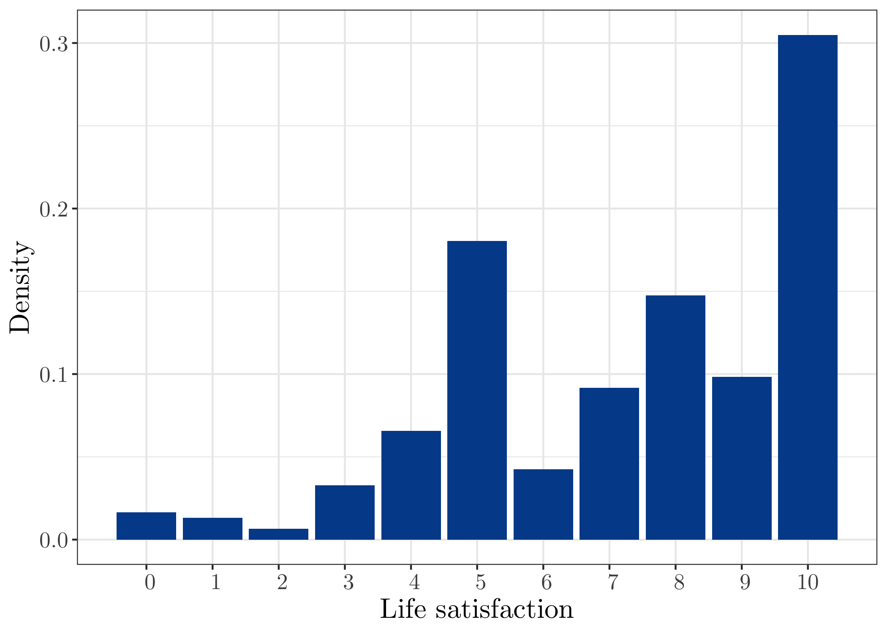
```

### Treatment
The treatment is represented by a binary variable, indicating whether a student participated in the treatment ("1") or not ("0"). The treatment is conducted on the class level. All students in the same class are assigned the same indicator of whether or not they attend the treatment. Students did not change the class. Treatment also appears in the data set as an interaction term with each time period in that a treatment effect can be measured. Multiplying the binary indicator of treatment with the dummy variable for each period gives four indicators with the variable indicating 1 if the observation was in the treatment group and was made in the respective wave and 0 otherwise.

### Individual characterisitc background
In the first wave, students were asked to state their gender. This question did not appear in subsequent waves which leads to the issue that children who were not in school on the day the first questionnaire was handed to them, appear as NAs in the sample. The same happened for migration background. To avoid drop out of too many observations in the estimation process, gender and migration background were manipulated as category variables and NAs were replaced by the category *unknown*. This leads to the following distribution of time-invariant individual characteristics: Both the gender and the migration background is not known for around 20% of the total of 390 students. The available data show that out of the remaining students, 45% are female and 36% have a migration background.

The fact that it is an unbalanced panel where not all the children attended each wave should be considered more thoroughly. In Table&nbsp;\@ref(tab:N-Obs-per-wave-school) , the number of students in each school and each wave is presented. It shows that the number of students is varying from one wave to another, most severely in class five. In that class, the number of participants of the questionnaire drops by a third in wave 5 compared to the first period. The overall effect of this decline on the whole sample is shown in Table&nbsp;\@ref(tab:N-Obs). In the treatment group, the number of students decreases from 154 in wave 1 and is the lowest in wave 4 with 137 participants. In the control group, there are 144 to start with and only 134 in wave 5. This could be a reason to exclude school five from the observation completely as the attrition rate in the remaining schools is not that alarming. In total there were 1500 students observed throughout the five waves, however I excluded the students that did not report their satisfaction. If I had left them in the sample, this would have lead to problems in the posterior predictive checks because when the 'brmsfit' fits the model, any N/As are excluded automatically. Without these observations, there are 1429 left.
```{r N-Obs-per-wave-school, echo=FALSE}
n_obs <- readRDS("../results/n_obs.RDS")
knitr::kable(n_obs, booktabs = T, linesep = "", caption = "Number of observations by school") %>%
  kable_styling(latex_options = "HOLD_position")
```
As a third individual background variable, I included if a student had some musical experience before the project had started. I expected students who already played an instrument before or received private music lessons would be more drawn to the treatment class. Also, as I want to find out if the project made students more satisfied, any previous effects of music on satisfaction should be minimized.
```{r N-Obs, echo=FALSE}
n_obs_treat <- readRDS("../results/n_obs_treat.RDS")
knitr::kable(n_obs_treat, booktabs = T, caption = "Number of observations by treatment") %>%
  kable_styling(latex_options = "HOLD_position")
```

## Pre-treatment differences
\label{sec:pre-treat-diff}
The treatment groups were not randomized, but formed by choice. This makes it a quasi-experimental study where the decision who attended the treatment group was made before the entrance to grade 5. Parents could choose to put their child into a music class. Therefore, the experiment is not fully randomized. Children who were already practicing music in the first place might have been more likely to enter the music class. Also, the decision can be a a consequence of parental and socio-economic background of the student. To have a better idea of possible differences between the treatment and the control group, I computed standardized mean differences:
```{r std-mean-diff, echo=FALSE}
extract_smd <- readRDS("../results/extract_smd.Rds")
knitr::kable(extract_smd, booktabs = T, caption = "Standardized mean differences",  col.names = c("Treated = 1 vs 0"), digits = 2) %>%
  kable_styling(latex_options = "HOLD_position") %>%
  row_spec(row = c(10,11), background = "#cce5ff")
# https://cran.r-project.org/web/packages/tableone/vignettes/smd.html
```
The standardized mean differences are not a reason for concern in this setting. For most of the observed variables, there are no notable differences between the treatment group and the control group. However, as already suspected, there are differences in prior musical knowledge. Among the treated, there are relatively more children who have music as a hobby before the project has even started. Of the 87 students who answered with "yes" to the question if music was their hobby, only 24 were assigned to the control group and the remaining 63 students attended the band classes. Also, the duration of making music is very different in the two subgroups. In the Treatment group, 56% are practicing at least 30 min, while in the control group that share is only 35%. However, the model addresses this issue by applying a difference-in-difference approach to estimate the causal effect of additional music lessons on students' well-being. Possible differences in the control group and the treatment group are not a problem for inference.

## Measuring LS in children
\label{sec:measurement}
To investigate ones quality of life, research uses both objective and subjective indicators. Typical objective indicators are the income levels, crime rates, and access to medical services -- measures that are external and quantifiable. Subjective indicators on the other hand comprise subjective evaluations of ones' individual life circumstances [@Gilman2000, p. 178]. Only a modest relation between both measures was found which indicates that each approach carries unique information that are relevant for a comprehensive understanding of overall life quality [@Veenhoven1996]. Over time, measurement methods for subjective indicators have evolved, leading to substantial growth in the life satisfaction research. However, for a long time, most of the measurements were designed to assess adults' life satisfaction. Only recently, investigating correlates of life satisfaction in adolescents has begun. One reason why life satisfaction research in children was put off for a long time is probably that measuring life satisfaction in children is more challenging than for adults. Instruments for assessing children's subjective life satisfaction reports have been less intensively developed which is probably due to the fact that a Likert-type ratings scale is more difficult to use for younger children than for adolescents [@Johnston2002, p. 28]. For example, younger children or children with poorer readings skills are less able to respond appropriately to negative items on questionnaires and this effect biases the interpretation of children's responses [@Marsh1986, p. 45]. It is also common for children rating their subjective life satisfaction to show elevated extreme scores. As children become older, this tendency subsides and they are more capable of providing graded ratings in between the two extremes. These results have potentially substantial implications for the interpretation of self-report ratings form children *this tendency might have an erroneous and invalid impact on the interpretation of children's self-reports* [@Johnston2002, pp. 33-34]. When dealing with self-reported life satisfaction in children, it is crucial that the respective child fully understands the question in order to give a valid response [@Gluskie2012; @Tomyn2016]. One must make sure that a child is old enough to know how to use a satisfaction scale. This requires children to distance themselves from the current situation, cognitively evaluate their life satisfaction (considering all relevant areas of life) and rate the degree to which certain items on the scale apply to them. This requires abstract thinking, which children develop in early adolescent years (10-14 years) [@Gluskie2012; @Piaget1955; @Piaget1969]. @Gilman2000 have reviewed five different (both unidimensional and multidimensional) measurements explicitly developed to asses adolescents' life satisfaction ^[The Students' Life Satisfaction Scale [@Huebner1991a], the Satisfaction With Life Scale [@Diener1985], the Perceived Life Satisfaction Scale [@Adelman1989], the Comprehensive Quality of Life Scale -- School Version [@Cummins1997; @Gullone1999], and the Multidimensional Student's Life Satisfaction Scale [@Huebner1994]]. The authors evaluated those measures in terms of validity and reliability and found all of the scales to be appropriate for research with adolescents (pp. 181-188). The demographic characteristics of the available samples show that all of the adolescents observed were older than 12 years. Therefor it remains unclear if children younger than that age are able to report valid satisfaction.
An other instrument was developed by [@Cummins2005], the Personal Well-being Index (PWI-SC). Again, studies demonstrated reliability for this instrument as well [@Casas2011; @Casas2015; @Tomyn2011a; @Tomyn2019]. But also in those studies, all of the adolescents were at least 12 years of age, mostly even older. There is only very little evidence on the psychometric properties of the PWI-SC for children below the age of 12.
One of them is @GonzalezCarrasco2016 [p. 70] who applied the instrument for children as young as only 9 years and also found adequate fit of the data.
On the other hand, @Tomyn2016 conducted a study with children aged 10-12 and concluded that subjective well-being data of children must be interpreted with caution. They also show that response bias towards the extreme positive end of a scale is higher with decreasing age. The authors do not recommend using the PWI-SC for children younger than 12 years. As for the specific sample, the PWI-SC did not serve as a valid instrument for measuring the SWB.

In conclusion, measuring life satisfaction in children is more challenging than for adults and is still in progress. It is advisable to check the validity and reliability of their data when testing children. Considering, the majority of the children from the KIP project are 10 year sold in wave 1 (72% of those participating in wave 1), they might be just too young to give valid responses when asked about their life satisfaction. This must be kept in mind when evaluating the results.

# Identification strategy
\label{ch:identification}
As I already mentioned in the introduction, I will make use of a multilevel model, precisely a varying-intercept and varying-slope multilevel model. A multilevel model is a good choice for drawing causal inference but also for prediction and descriptive modeling [@Gelman2013, p. 6].
In the following, I will summarize important aspects of the methodology of those models and explain how multilevel models are best to navigate between underfitting (too few parameters included in the model) and overfitting (too many parameters included in the model). In the second part, I will give an introduction to Bayesian analysis that is the ideal method for multilevel modeling because of its underlying assumption that all parameters are random quantities.

## Multilevel modeling
Since the sample is structured hierarchically, with students nested within schools, observed in several time periods, using a simple nonhierarchical model would be inappropriate. In practice, simple nonhierarchical models with few parameters generally cannot fit large data sets accurately, whereas with many parameters, they tend to overfit such data. Though fitting the data well, often seems to be the goal of data analysis, these models are usually very poor in making predictions for new data [@Gelman2013, 101]. (fit to sample always -- not true of multilevel models -- improves as we add parameters.) In the context of the intervention under study, each school may well have a different average life satisfaction tendency or respond differently to the treatment. The data should benefit from a model that expects such variation.

A multilevel model is a linear model in which parameters are given a probability model. @Mcelreath2020 [p. 14] suggests to think of parameters as placeholders for a missing model. That probability model itself has parameters called hyperparameters which are also estimated from the data. In other words, there are parameters for parameters for parameter and so on. Technically, there is no limit to the number of levels, however infeasible computation and ability to understand the model are in practice a restriction. Though multilevel models are more complicated, it is worth using them because they produce better estimates mcelreath, 15. In the context of the observed study, a multilevel model works extremely well because of several reasons [Mcelreath2020, p. 15]:
\begin{itemize}
\item Adjusting estimates for repeat sampling -- having more than one observation arising from the same student, a traditional, single-level model may be misleading
\item Adjusting for imbalance in sampling -- some students are sampled more than others, again, a single-level model could be misleading in this case
\item Studying variation -- I am interested in the variation of the treatment effect among schools. Multilevel models are of big help in this case because the model variation explicitly.
\end{itemize}
Multilevel models involve predictors at different levels of variation. In the KIP setting that means that it is possible to measure different effect sizes throughout time in each of the schools. It is likely to observe different response behaviors among the schools. Depending on the school, students might react differently to the project. This is an important investigation to find out if the intervention was more effective in some schools than in others. One school might have done something explicitly well or had to face challenges other schools did not. Learning from these findings could possibly help to improve the project in the future.

In a classical regression, assigning varying effects to each group is done by using interaction terms or running separate regressions for each subgroup of the sample. However, this has the disadvantage that estimates can be very imprecise, in particular when there are only few observations per group. Estimating parameters for each group separately is referred to as *no-pooling* because each group is observed independently without considering the rest of the sample. On the other hand, ignoring the hierarchical structure and *completely pooling* the information is also not recommended, because existing effects might disappear as illustrated in Figure&nbsp;\@ref(fig:lsat-vs-time): if solely taking the mean over all schools (solid purple line), there is almost no change in life satisfaction through time. But when each school taken separately (dashed blue lines), there are clear dynamics that substantially differ from each other. While in some schools average life satisfaction is decreasing with different rates, in other school opposite trends are visible.
```{r lsat-vs-time, echo=FALSE, echo=FALSE, fig.cap= c("Mean life satisfaction across schools","Purple line: Average over all schools"), out.width = "80%", fig.align='center'}
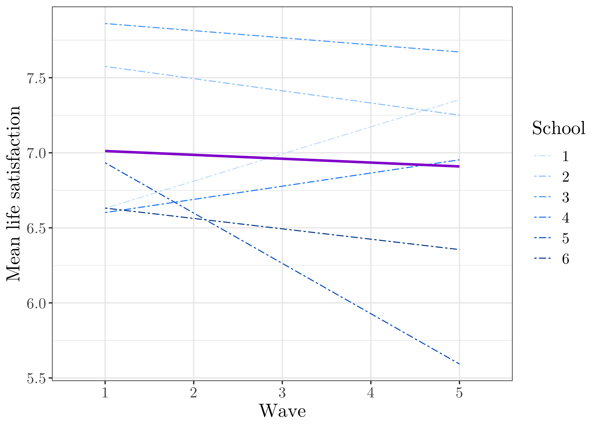
```
Both approaches, no-pooling and complete pooling, have downsides for different reasons but they can be useful preliminary estimates, eventually leading up to what is known as partial pooling that comes out of a multilevel analysis. Therefore I will illustrate both the extremes,  the complete pooling and the no-pooling approach in the following, before I get to the details of partial pooling. The complete pooling and no-pooling model in comparison to the partial pooling model will be presented in a very simplified way. Life satisfaction will be explained with a varying-intercept model without any predictors. The purpose is to emphasize the characteristic features of the three approaches without unnecessary complexity in the model. In this example, $\alpha$ and $\sigma$ are given weakly informative priors and the models are estimated using `rstanatrm` functions `stan_glm` and `stan_glmer`.

The simplest approach of the three is the pooled model, where life satisfaction is modeled as independent and identically distributed draws from a common distribution. The intercept $\alpha$, the average life satisfaction in this case, is the same for each school.
\begin{align*}
LS_i & \sim {\sf {Normal}} (\alpha, \sigma) & \quad \text{for } i \in 1,...,n \\
\alpha & \sim {\sf Normal} (0, 10) \\
\sigma & \sim {\sf Exponential} (1)
\end{align*}
In the complete pooling approach, the population of schools is assumed to be invariant. This ignores the fact that schools are different and assigns the same intercept to each of the schools. If done like this, there is the risk of ignoring important variation in how schools correspond to the treatment [@Mcelreath2020, p. 416]. The total sample mean underfits the data, meaning that the model is insensitive to the details in the data and is learning too little from it. Ignoring the group-level variation is very likely misleading.

Whereas complete pooling ignores variation between schools, the no-pooling analysis overstates it and gives a different mean to each school:
\begin{align*}
LS_i & \sim {\sf Normal} (\alpha_{j[i]}, \sigma) & \quad \text{for } i \in 1,...,n \\
\alpha_{j} & \sim {\sf Normal} (0, 10) & \quad \text{for } j \in 1,...,m,
\end{align*}
where $j[i] \in 1,...,m$ is the school of student $i$.
Although the $\alpha_j$ is drawn from the same prior distribution, it has fixed parameters and thus no information is shared between observations in different schools. This makes the model very sensitive to the details in the data, you could say it is learning too much from it. The no-pooling approach includes the assumption that the schools are completely different and one school cannot tell anything about the other schools. This is equivalent to the variation among schools being infinite. But in reality, though schools are different in some ways, they are also very similar so that each school helps to estimate the treatment effect in other schools. One should choose a model that incorporates the idea of learning from other groups while still accounting for systematic differences among the groups. This is exactly what partial pooling is attempting.

Partial pooling represents a compromise between the two extremes of excluding a categorical predictor from a model (complete pooling), or estimating separate models within each level of the categorical predictor (no pooling). For this simplified model with no predictors, the multilevel estimate for a given school $j$ can be approximated as a weighted average of the mean of the observations in the school (the unpooled estimate, $\bar{y}_j$) and the mean over all schools (the completely pooled estimate, $\bar{y}_{\mathrm {all}}$):
\begin{align}\label{eq:weighted_average}
\hat{\alpha}_j^{\mathrm {multilevel}} \approx \frac {\frac{n_j}{\sigma_y^2}\bar y_j + \frac {1}{\sigma_{\alpha}^2}\bar y_{\mathrm {all}}}{\frac {n_j}{\sigma_y^2} + \frac {1}{\sigma_{\alpha}^2}},
\end{align}
where $n_j$ is the number of students in school $j$, $\sigma^2_y$ is the within-school variance in LS, and $\sigma^2_j$ is the variance among the average LS levels in the different schools. For keeping the example simple, I assume the within-school variance to be constant among the schools [@Gelman2013, p. 254].
The weighted average describes the ratio of information available about the individual school and the average of all the schools. Depending on that ratio, the weighted average converges to one of the two extremes, either no-pooling or complete pooling.
\begin{itemize}
\item A school with only few students carries less information, and the weighting pulls the multilevel estimate closer to the overall state average. If $n_j=0$, the multilevel estimate is simply the average, $\bar y_{\mathrm {all}}$.
\item Averages from larger schools carry more information, and the corresponding multilevel estimates are close to the school average. If $n \rightarrow \infty$, the multilevel estimate is simply the country average, $\bar y_j$
\item In intermediate cases, the multilevel estimate lies between the no-pooling and the complete pooling estimate.
\end{itemize}
This means that in the partially pooled model, still each school has its own mean values but with the difference that these school-means share a prior which has its own parameters&nbsp;[@Gelman2013, pp. 253-254].
\begin{align*}
LS_i & \sim {\sf Normal} (\alpha_{j[i]}, \sigma) & \quad \text{for } i \in 1,...,n \\
\alpha_{j} & \sim {\sf Normal} (\mu, \tau) & \quad \text{for } j \in 1,...,m
\end{align*}
We could also write the model with the school-level average in the mean equation for $y$, and the $\alpha_j$ values distributed around the country level average, $\gamma$.
\begin{align*}
LS_i & \sim {\sf Normal} (\alpha_{j[i]}, \sigma) & \quad \text{for } i \in 1,...,n \\
\alpha_{j} & \sim {\sf Normal} (\gamma, \tau) & \quad \text{for } j \in 1,...,m \\
\tau & \sim {\sf Exponentional(1)}
\end{align*}

After fitting the above models, I extracted the estimates of each of them and plotted them in Figure&nbsp;\@ref(fig:compare-models).
```{r compare-models, echo=FALSE, echo=FALSE, fig.cap="Comparison of models", out.width = "80%", fig.align='center'}
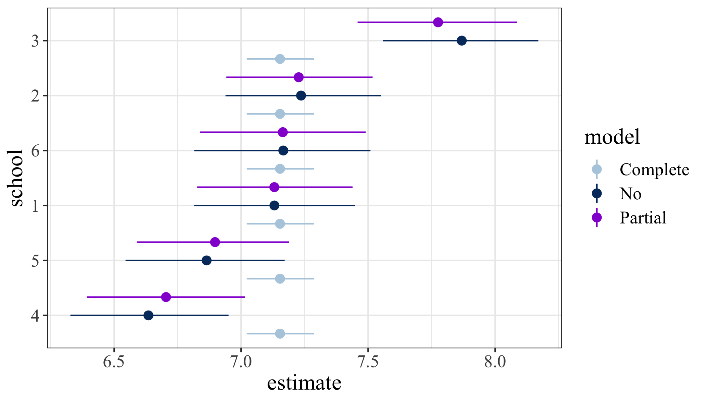
```
It shows clearly that when partially pooling information, both similarities and differences among groups are comprised. Partial pooling uses all the data available to perform inference for groups instead of just using local information which is especially useful when there is only a small number of observations in each group. The group estimates are supported to the extend of the whole data set and are not being limited to the number of observations per group. These estimates are less underfit than the grand mean and less overfit than the no-pooling estimates. As a consequence they tend to be better estimates of the true per-school means [@Mcelreath2020, p. 423]. Visually, this is shown by the purple dots (partial pooling), always being somewhere between the no-pooling estimates and the partial pooling estimates and being pulled towards the grand mean. The difference between the classical no-pooling estimates and the results from partial pooling is not very drastic. This is probably because the group-level variation is relatively small and that makes the multilevel model reduce to a classical regression with no group indicators. Also, the number of groups (6) is quite small which might be a reason why group-level variation cannot be estimated accurately. Still, it is worth the effort of expanding a classical regression in this way when adding the third level for the time periods later in the estimation. Generally, partial pooling will be especially helpful when there are only few observations in one school because then the no-pooling estimate will be overfit significantly. The difference between no-pooling and partial pooling becomes smaller, the more observations there are per cluster. The partial pooling produces noticeably better estimates and therefore will be used for my estimation. There are different tools to create a model that partially pooles information. In practice the variance parameters together with the $\alpha_j$'s are either estimated with an approximated program such as `lmer()` or using fully Bayesian inference. Since multilevel models, have a natural Bayesian representation (as they are models with multiple levels of uncertainty), a Bayesian data analysis favorable [Mcelreath2020, p. 14; @Gelman2013, p. 143]

## Bayesian inference
To set up what will follow in Chapter&nbsp;\@ref(ch:estimation) which is about the explicit estimation, stylized components of a Bayesian statistical model are explained and formally written down. The notation is based on @Gelman [ch. 1].

The interest of Bayesian data analysis lies in drawing statistical conclusions about unobservable vector quantities of population parameters, denoted by $\theta$, and making predictions about unobserved data $\tilde{y}$. These conclusions are made in terms of probability statements that are conditional on the observed data  $y$. So the goal is to find out what is $p(\theta|y)$ and $p(\tilde y|y)$. For every parameter, there needs to be a distribution of prior probability, its prior $p(\theta)$. This is the initial plausibility assignment for each possible value of the parameter from which the Bayesian model is updating with the data $y$.

\begin{itemize}
\item $p(\theta|y)$:

To make a probability statement about $\theta$ given $y$, a joint probability distribution for $\theta$ and $y$ is needed in order to apply Bayes' rule. The joint probability function is  the product of two densities: the prior distribution $p(\theta)$ and the likelihood $p(y|\theta)$, also called sampling distribution or generative model.
The prior distribution $p(\theta)$ specifies the what is known about $p(\theta)$ before observing the data as a probability distribution and the likelihood function indicates how likely the data are to appear, for each possible value of $p(\theta)$ [@Nalborczyk2019, pp. 6-7].
Updating of all of the prior distributions lead to the posterior distribution $$p(\theta|y)=\frac{p(\theta,y)}{p(y)}=\frac{p(\theta)p(y|\theta)}{p(y)},$$ where $p(y)=\sum_\theta{p(\theta)p(y|\theta)}$, and the sum is over all possible values of $\theta$ (or $p(y)=\int p(\theta)p(y|\theta)d\theta$ in the case of continuous $\theta$). Omitting the factor $p(y)$, which does not depend on $\theta$ and, with fixed $y$, can thus be considered a constant, the result is the unnormalized posterior density:
$$p(\theta|y) \propto p(\theta)p(y|\theta).$$ This expresses that the posterior is proportional to the product of the prior and the likelihood.

\item $p(\tilde y|y)$:
To make predictive inferences, a similar logic is applied:
The distribution of the unknown but observable $y$ is
$$p(y)=\int p(y,\theta)d\theta=\int p(\theta)p(y|\theta)d\theta,$$ which is referred to as the prior predictive distribution. The prior predictive distribution is
\begin{itemize}
\item not conditional on previous observations of the process
\item a distribution for a quantity that is observable.
\end{itemize}
From the same process, $\tilde{y}$ can be predicted after observing the data $y$.
The distribution of $\tilde{y}$ is called the posterior predictive distribution. The posterior predictive distribution is
\begin{itemize}
\item conditional on $y$
\item a prediction for an observable $\tilde y:$
\begin{align*}
p(\tilde{y}|y) & =\int p(\tilde{y},\theta|y)d\theta \\
& = \int p(\tilde{y}|\theta,y)p(\theta|y)d\theta \\
& = \int p(\tilde{y}|\theta)p(\theta|y)d\theta.
\end{align*}
\end{itemize}
The equations express the posterior predictive distribution as an average of the conditional predictions over the posterior distribution of $\theta$. Given $\theta$, $y$ and $\tilde{y}$ are assumed to be conditional independent.
Having decided on a specific probability model, the data $y$ affect the posterior inference \emph{only} through $p(y|\theta)$, the likelihood function. 
\end{itemize}
To wrap up the above: Bayesian inference refers to statistical procedures that model unknown parameters (and also missing and latent data) as random variables. It starts with a prior distribution, beliefs about the parameter before having examined the new data, and updates it with the likelihood of the data, yielding a posterior distribution which is used for inferences and predictions [@Gelman2013, p. 143] (--> der absatz ist kopiert, aber ich finde keine guten worte. kannst du da ein bisschen umformulieren?)

# Estimation
\label{ch:estimation}
For model estimation I decided to use the `brms` package by @Buerkner2017. It implements Bayesian multilevel models in `R` using the probabilistic programming language `Stan`. It allows for individual prior specifications and facilitates incorporating prior distributions that reflect the users' beliefs. Different numerical techniques for computing the posterior distribution. In the `brms` package, Markov chain Monte Carlo (MCMC) is the technique used to fit the data. MCMC does not approximate the posterior distribution directly but draws samples from the posterior. This leads to a collection of parameter values of which the frequencies correspond to the posterior plausibilities [@Mcelreath2020, p. 45]. 

## The model
\label{sec:model}
The goal of my estimation is to identify the causal effect of the treatment on the well-being of the participating students. But the development of the satisfaction measures could have altered due to other variables, besides the introduction of the music project. Therefor, I make use of the Difference-in-Difference (DD) method and compare the treatment group to the control group. This helps removing the confounding effect after the intervention period and arrive at the real causal impact.
The underlying common trend assumption implies that both groups follow the same trend in the pre-treatment and the treatment group would have the same trend as the control group in the the-post intervention period in the absence of the treatment. Then the difference in the change of LS is the actual treatment effect.

This way, the problem of significant pre-treatment differences is avoided because DD-regressions allow for systematic differences due to group-specific time-invariant characteristics.
The model I am using to fit the data includes varying intercepts on the school level and on the student level and varying slopes for each school. This assumes that schools have similar features but it also recognizes that unmeasured aspects on the students or schools can lead to variation in treatment effects. It allows for differences in how individuals or groups respond to the same circumstance. The specific regression equation is:
\begin{align}\label{eq:ml_DDmodel}
y_{ijt} = \beta_0 + \beta_{1j[i]} T_i + \sum\limits_{l=2}^5\delta_{lj[i]} (T_{i} \cdot 1[l=t]) + \sum\limits_{l=2}^5\lambda_l\cdot 1[l=t] + \mu_{j[i]} + \alpha_{i} + \epsilon_{ijt},
\end{align}
where $y_{ijt}$ is the outcome of pupil $i$ in school $j$ at time $t$. $T_{i}$ is a binary indicator of whether or not pupil $i$ attends a class with additional music education. $\delta_l$ is the period-specific treatment effect at time $l$. $\lambda_l$ are period fixed effects. We model school-specific effects and individual-specific effects by including $\mu_{j}$ and  $\alpha_{i}$, respectively. $\epsilon_{ijt}$ is an error term.

The multilevel model in equation&nbsp;\ref{eq:ml_DDmodel} allows the period-specific coefficients $\delta_l$ (i.e.,&nbsp;the coefficient on the interaction terms between the treatment group indicator, $T_i$, and the dummy variables for the periods) to vary across school. In doing so, we are able to examine potential heterogeneity in the treatment effects of the intervention across schools, which may provide insights into contextual factors of schools that promote or hinder pupils to benefit from the intervention. Furthermore, the model includes random intercepts at the level of schools, $\mu_j$, as well as at the level of pupils, $\alpha_{i}$, represents an individual-specific effect. The random intercepts capture that average well-being may vary across schools and/or across pupils. The multilevel model takes into account that our data has a hierarchical structure that is defined in terms of three clusters. We have repeated measurements of outcomes (level 1) for the same pupils (level 2). The pupils are nested within schools (level 3). The hierarchical structure implies, for instance, that pupils within a school are more similar than pupils from different schools.^[School-level effects and pupil-level effects may be modeled by including separate sets of indicator variables for each school, each class, and each pupil. However, these effects are not identified separately in a balanced panel because the school-level effects are a linear combination of the individual-level effects. Hence, $\mu_j$ and $\alpha_{i}$ cannot be estimated together because of perfect collinearity. Furthermore, estimating a potentially large number of parameters is inefficient and generalizations to the population of pupils are not straight forward [@Wood:2017].]

## Prior distribution
\label{sec:priors}
As stated above in Chapter&nbsp;\@ref(ch:identification), in a Bayesian framework parameters are not point estimates but they have distributions. The specification for these parameters are called prior distribution because they must be specified *before* the model is fit to data and it assigns them a probability to every possible value of each parameter to be estimated. If the specification is done properly for all parameters in the model, a Bayesian model yields a joint prior distribution on parameters and data, and hence a prior marginal distribution for the data [@Gabry2019, p. 5]. This process can be described as the prior distributions and data interacting to eventually produce the posterior distribution. The posterior can be seen as a compromise between the prior distribution and the likelihood function. Therefore, the choice of the prior should be done carefully since it can determine the outcome severely, depending on how informative the data are. So after specifiying a likelihood function for the data, I had to decide on the priors I want to use. For every parameter, `brms` sets a default prior. Those default priors are flat and should be changed to at least weakly informative priors if possible [@Mcelreath2020, p. 302].

The prior distribution indicates the beliefs about the distribution of each parameter without knowing the specific data. Depending on the choice of prior and the respective data set, the "compromise" favors one of them over the other. Flat priors or super-vague priors (${\sf Exp}(0.5)$) are usually not recommended. They lead to a posterior distribution that is mainly influenced by the data which means that though the data set is very well described by the model, predictions are very poor. The model learned about the distribution from the data only because the prior did not carry any information. However if the prior has strong beliefs about the distribution of the parameters, meaning the prior distribution is sharply peaked, and there are only relatively few data, the posterior distribution is more influenced by the prior. Generally, weakly informative priors (${\sf N}(0,10)$) are recommended because they help by providing a very gentle nudge towards reasonable values of the parameter [@Mcelreath2020, p. 299]. If there is a reasonable large amount of data, they will dominate while the prior becomes less important. In case of not very meaningful data though, the "weakly informative prior" makes up for it by strongly influencing the posterior inference. This relation is illustrated in Figure&nbsp;\@ref(fig:flat-peaked). The upper row shows the posterior that appears when having a prior distribution $LS \sim {\sf Exponential}(0.5)$. This prior gives barely any useful information about the distribution of life satisfaction among the population. The shape of the posterior is identical to the one of the likelihood. The opposite is the case when the prior is highly informative. A normal distribution with parameters of $\mu = 5$ and $\sigma = 1$ suggests that life satisfaction is very narrow around the mean of 5. The prior is so sharp that the posterior distribution is noticeably influenced by the prior.
```{r flat-peaked, echo=FALSE, fig.cap="Flat vs peaked prior", out.width = "80%", fig.align='center'}
knitr::include_graphics("../figures/flat_peaked.png")
```
A good prior also tackles the problem of overfitting in favor of making better predictions. As discussed in Chapter&nbsp;\@ref(ch:identification), overfitting happens when the model is too sensitive to the sample. Choosing a flat prior means that every parameter value is equally plausible and therefore the posterior encodes as much of the likelihood function as possible. Overfitting can be avoided by choosing a skeptical prior. The term skeptical refers to the prior being skeptical about values outside the range of parameter values that are not reasonable. The most common skeptical prior is the regularizing prior which effectively reduces overfitting while still allowing the model to learn about the regular features of a sample [@Mcelreath2020, p. 219].

To evaluate the chosen prior, a prior predictive check can be helpful. It examines what data sets would be consistent with the prior. Prior predictive checks will not be calibrated with actual data, but extreme values help diagnose priors that are either too strong, too weak, poorly shaped, or poorly located. This method is useful for understanding the implication of a prior. It simulates predictions from a model, using only the prior distribution instead of the posterior distribution. Once priors are chosen, they imply a joint prior distribution of individual life satisfaction [@Mcelreath2020, p. 85]. This procedure is based on choosing priors conditional on pre-data knowledge of the data, on general facts so to say [@Mcelreath2020, p. 100]. Only when this step is done, the model is applied to the data.
Figure&nbsp;(fig:lsat-predicted) demonstrates, how the choice of different priors influences the posterior distribution. Samples from the prior predictive distribution are drawn, meaning that the samples solely come from the priors, ignoring the likelihood. The predicted posterior distributions have the same priors for the intercept, ${\sf N}(8,2)$, and for the standard deviation, ${\sf Exp}(0.5)$, but different priors for the population-level and group-level priors are applied. 
```{r lsat-predicted, echo=FALSE, fig.cap="Prior predictive distribution", out.width = "80%", fig.align='center'}
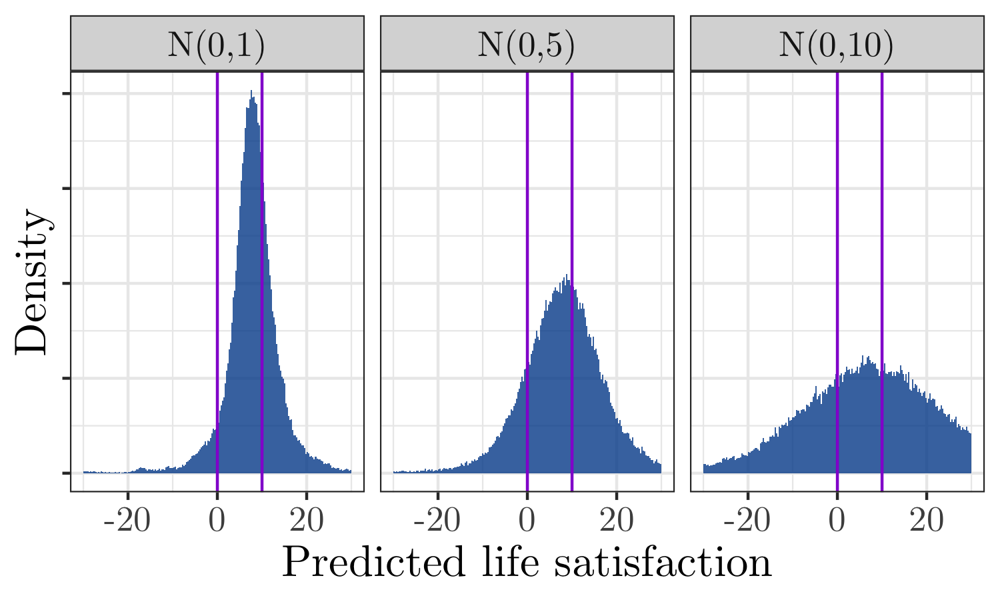
```
On the left, the prior for the population- and group-level estimates is normally distributed with $\mu=0$ and $\sigma=1$. The parameters for the prior that produced the middle plot are $\mu=0$ and $\sigma=5$, and for the right plot $\mu=0$ and $\sigma=10$. The purple lines represent the lowest and the highest value from the life satisfaction scale. The prior that I used for the final estimation is the one on the left because in that plot, most of the density is within the limits of the scale.

A prior should be chosen in a way that ensures that most of the prior mass is in parts of the parameters space that corresponds to reasonable data generating processes. The priors that I chose are distributed as Figure&nbsp;\@ref(fig:chosen-priors) shows.
```{r chosen-priors, echo=FALSE, fig.cap="Density of chosen priors", out.width = "80%", fig.align='center'}
knitr::include_graphics("../figures/plot_priors.png")
```
The priors reflect the constraints on the system in the way that most of their mass  is in parts of the parameter space that correspond to reasonable data generating processes. The priors should not lead to any unintended structure in the parameters space and hence in the data generated using the full probabilisitc model [@Gelman2017].

## Model validation
\label{sec:validation}
After fitting the model in the previous section, I will now check its fit to data. A basic approach to asses the models adequacy is what is described as "phenomenological Bayesian monitoring" in @Rubin1981 [p. 394] (see also @Gelman, ch. 5.5). The method is as follows. The posterior distribution, the distribution of the model parameters conditional on the observed data, can be used to generate a posterior predictive distribution. The implied predictions come from sampling from the posterior distribution to simulate predictions.  The idea behind this approach is then to compare the posterior predictive distribution to a) the actual data and b) scientific judgment about plausible values of such data. If the model fits well, there should not be any systematic differences between what the model predicts to what the real data show and they will not contradict with plausible values but will be typical of them. Recalling Chapter&nbsp;\@ref(ch:identification), the posterior predictive distribution is
$$p(\tilde{y}|y) =\int p(\tilde{y}|\theta)p(\theta|y)d\theta,$$
where $y$ is the current data, $\tilde y$ is to be predicted, and $\theta$ are the model parameters.
I chose a graphical representation of the PPCs. Instead of calculating posterior probability, simulated data are plotted, to be visually compared to observed data. 
Figure&nbsp;\@ref(fig:post-dens-overlay) shows many replicated data sets drawn from the posterior predictive distribution (thin light lines). Thinking predictively, these are data that would be observed in the future if the experiment was replicated with the same model and the same value of $\theta$ that produced the observed data $y$. They are compared to the empirical distribution of the observed outcome (thick dark line). It is evident that the model is able to simulate new data that are similar to the observed life satisfaction with the exception that the exceptional high frequencies of the value 5 and 10 on the satisfaction scale cannot be reflected correctly.
On the right side of Figure&nbsp;\@ref(fig:post-dens-overlay), the light bars show the distribution of the mean valaue in the replication which captures the computed mean of the observed $y$ well.
```{r post-dens-overlay, echo=FALSE, fig.cap="Posterior predictive check - life satisfaction", fig.show = "hold", out.width = "50%", fig.align = "default"}
knitr::include_graphics("../figures/post_dens_overlay.png")
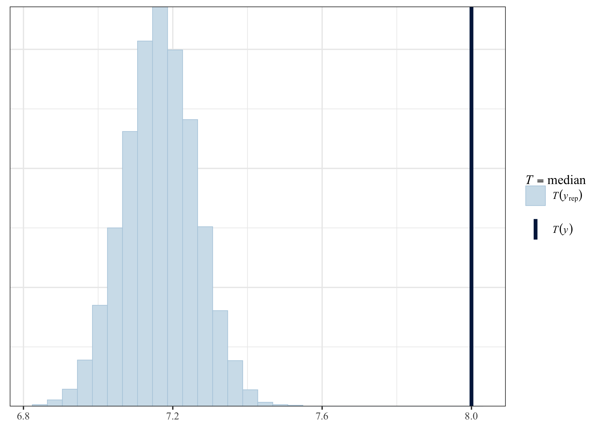
```
In Figure&nbsp;\@ref(fig:post-dens-overlay2), the PPCs are repeated for the three regressions of satisfaction with friends, class, and school. With the exception of the density of satisfaction with friends, all of the models predictions coincide weill with the actual data.
```{r post-dens-overlay2, echo=FALSE, fig.cap="Posterior predictive check - areas of satisfaction", fig.show = "hold", out.width = "30%", fig.align = "center"}
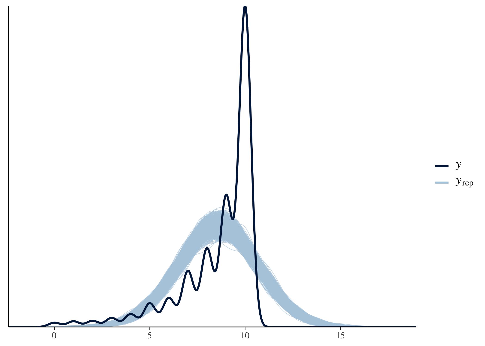
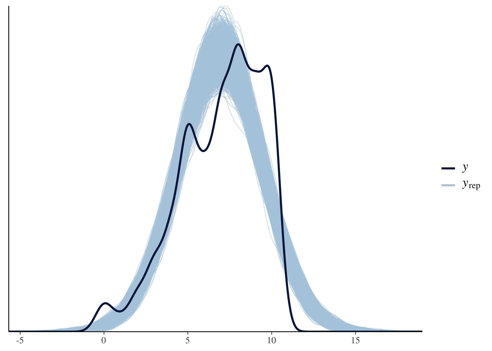
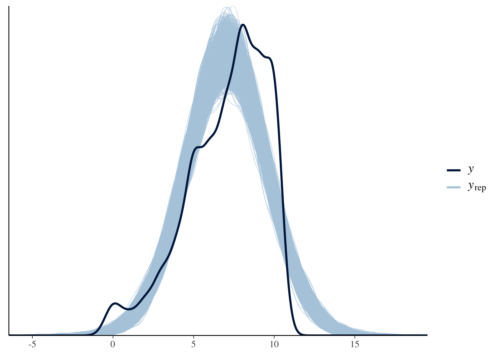
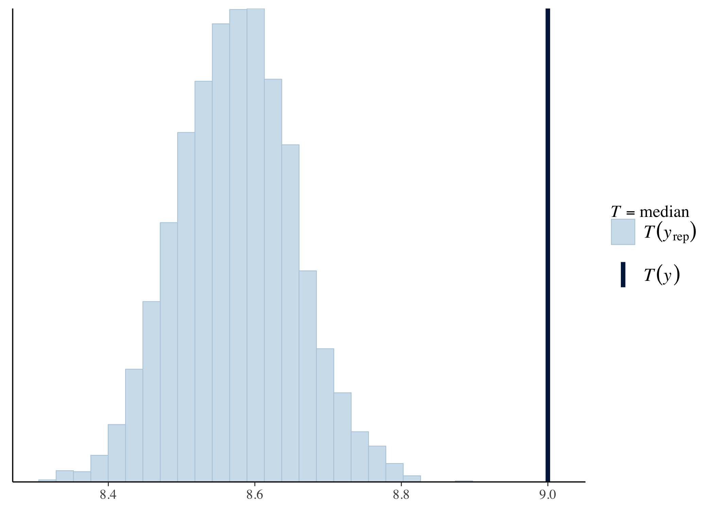
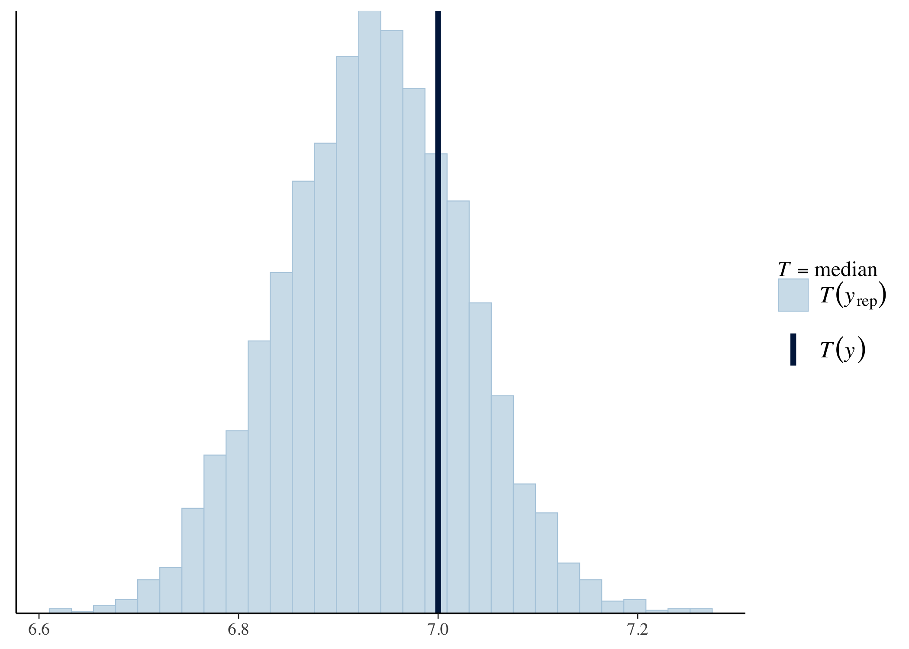
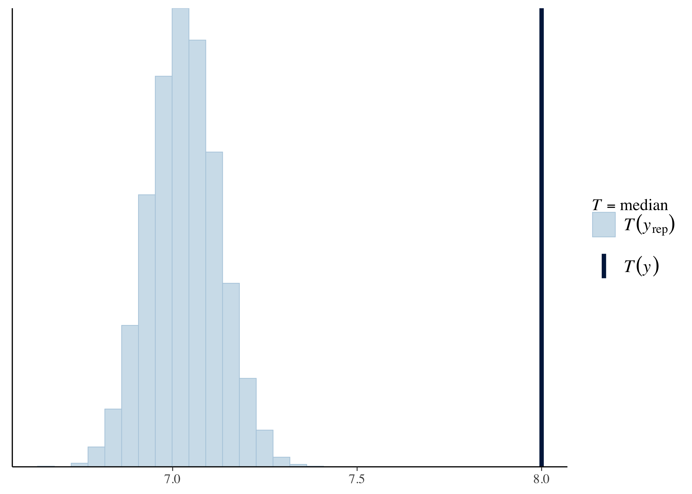
```

# Results
\label{ch:results}
In this chapter I will focus on the causal effect of the intervention on the students' life satisfaction. I will also bring in the results for the three observed areas of satisfaction. The general life satisfaction will be discussed in more detail than the satisfaction areas because this is where my main interest lies.

As for the model checking, good way for summarizing and interpreting the posterior distribution is to sample parameter values drawn from it. These samples can then be used to produce intervals and point estimates. The resulting samples will have the same proportions as the exact posterior density. Therefore the individual values of the parameters will appear in the samples in proportion to the posterior plausibility of each value [@Mcelreath2020, p. 52].

Figure&nbsp;\@ref(fig:m1-coef) summarizes point estimates for the median of the posterior distribution. When analyzing this figure, it is important to keep in mind that any point estimate in Bayesian analysis discards information. A Bayesian parameter consists of an entire posterior distribution and not just a single value. Besides the estimates, the figure includes specified intervals. Different names exist for the interval of posterior probability but I will refer to @Mcelreath2020 [p. 54], who prefers to call them compatibility intervals. These intervals indicate the range of parameter values compatible with the model and data.
The compatibility intervals in Figure&nbsp;\@ref(fig:m1-coef) state that out of 4000 values that are drawn from the posterior distribution, 90%(50%) lie within the boundaries of the thick(thin) lines. In other words, posterior intervals report two parameter values that contain between them a specified amount of posterior probability, a probability mass [@Mcelreath2020, p. 54]
```{r m1-coef, echo=FALSE, fig.cap="Parameter estimates", out.width = "80%", fig.align='center'}
knitr::include_graphics("../figures/m1_coef.png")
```

## Life satisfaction
\label{sec:life-satisfaction}
I will now come to the identification of the treatment effects. To give a general picture of how life satisfaction changed in the treatment and control group respectively, I averaged the predicted life satisfaction for each wave over all schools (\@ref(fig:lsat-pred)).
```{r lsat-pred, echo=FALSE, fig.cap="Predicted life satisfaction for average school", out.width = "80%", fig.align='center'}
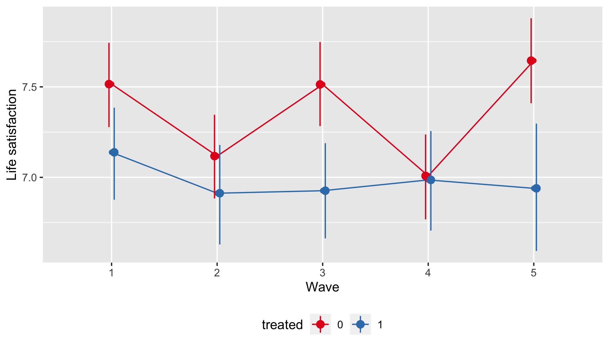
```
Overall, students from the treatment group (blue line) have a lower life satisfaction than the ones from the control group and do not show any large changes in their satisfaction level. After the first period, they become even slightly less satisfied and remain on the same level until the end of the project. The control group shows a different dynamic. Their satisfaction level drops by around 0.25 points on the satisfaction scale after wave 1, almost parallel to the treatment group. But the both groups then depart from each other as the control group goes up to the initial level in wave 3 to drop again in period 4. From period 4 to period 5, life satisfaction jumps back and even exceeds the level of period 1. Evaluating the average treatment effects in Figure&nbsp;\@ref(fig:lsat-teff), the differences between the control and the treatment group, indicate that the treatment effect appear not due to changes in the life satisfaction of the treated but are due to varying life satisfaction among the untreated. In other words, the differences between the control group and the treatment group are resulting from the the control group being quite volatile in their life satisfaction while the treatment group is rather consistent and generally on a lower level. The supposedly positive treatment effect that Figure&nbsp;\@ref(fig:lsat-teff) indicates in waves 2 and 4 simply appear because the difference between the treatment group and the control group are shrinking, compared to the previous period. Not because the treatment class is actually becoming happier. With all of the 80% uncertainty intervals crossing the zero-line, treatment effects are rather weak.
```{r lsat-teff, echo=FALSE, fig.cap="Treatment effects on life satisfaction for average school", out.width = "80%", fig.align='center'}
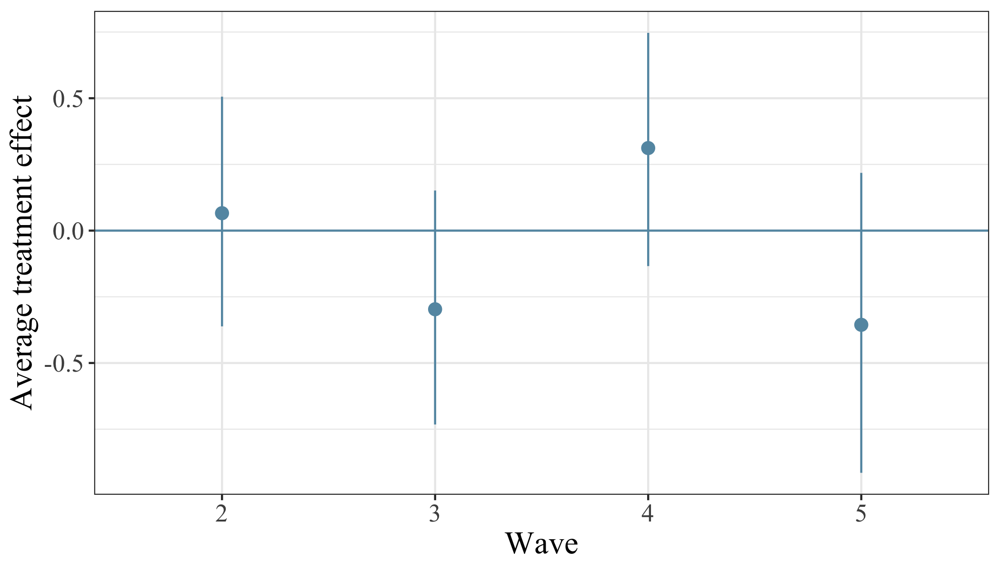
```
To reflect the heterogeneity across schools, Figure&nbsp;\@ref(fig:lsat-pred-across-schools) represents the school-specific predicted life satisfaction. The corrseponding treatment effects are shown in Figure&nbsp;\@ref(fig:lsat-teff-across-schools). The pattern from Figure&nbsp;\@ref(fig:lsat-teff) also appears in Figure&nbsp;\@ref(fig:lsat-teff-across-schools): There is a tendency of the treatment effects alternating from positive to negative from one wave to another. The magnitude of the effects however is extremely small and the 80% certainty intervals always cross the zero line. Wave 5 shows a diffuse situation where school five seems to be completely off. The effect appears because from wave 4 to wave 5, the control group in school 5 becomes more satisfied while at the same time, the average life satisfaction in the treatment class suddenly drops even though it showd a constant level in the previous periods. The problem of school five being not very trustworthy was already mentioned when the descriptive statistics were introduced in Section&nbsp;\@ref(sec:variables).
```{r lsat-pred-across-schools, echo=FALSE, out.width = "80%", fig.cap = "Predicted life satisfaction across schools", fig.subcap="Life satisfaction", fig.align='center'}
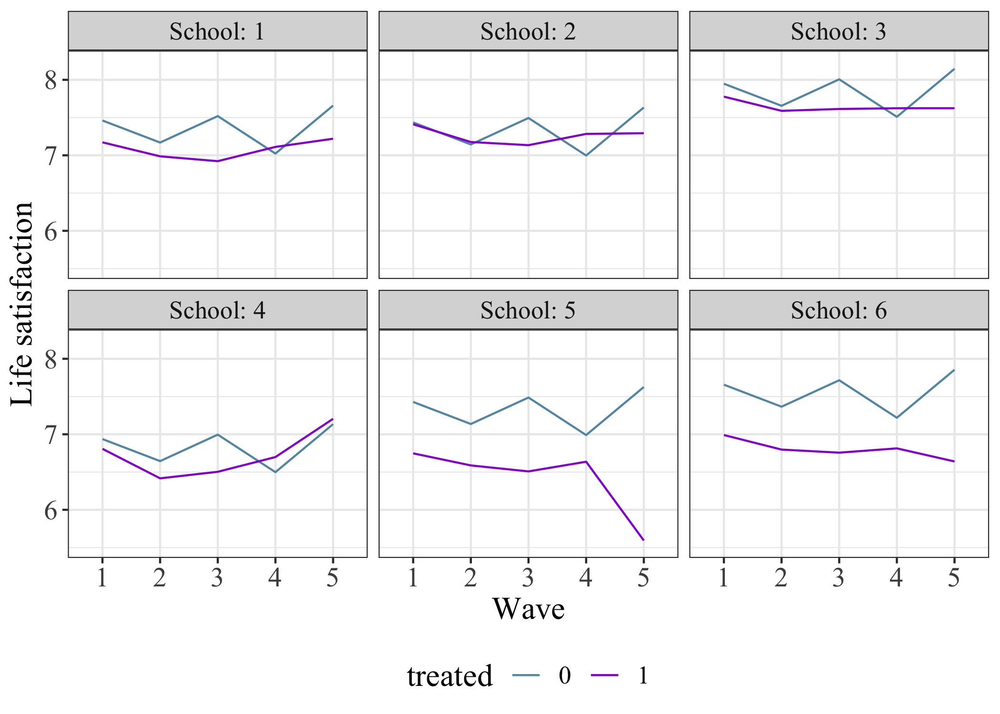
```
```{r lsat-teff-across-schools, echo=FALSE, out.width = "80%", fig.cap = "Treatment effects on life satisfaction across schools", fig.subcap="Life satisfaction", fig.align='center'}
knitr::include_graphics("../figures/lsat_teff_across_schools.png")
```

## Satisfaction with friends
\label{sec:results-friends}
The satisfaction with friends is negatively effected by the treatment. In both of the groups, the students tend to become less satisfied with their friends over the course of the five waves. (Figure&nbsp;\@ref(fig:sat-friends-pred)). The control group becomes a little more satisfied, by around 0.2 points on average, in wave 2 compared to the previous wave but then drops by more than 0.2 points in wave 3. It then stays on the same level of about 8.6. The treatment group drops consistently, being less satisfied with friends from period to period. The treatment group starts with a mean satisfaction at almost 9, which is the highest values observed in all of the areas, and reaches a level of even less than 8.2 in wave 5. The point estimates of the treatment effects are below zero in each school (Figure&nbsp;\@ref(fig:friends), right plot), as well as the 80% uncertainty intervals (Figure&nbsp;\@ref(fig:friends), left plot). Again, it is school 5 where the treatment group shows the most rapid drop in satisfaction with friends from 9 in wave 1 to 7.5 in wave 5. The other schools also also a decrease in their satisfaction levels but school 1 and school 3 show a tendency for increasing satisfaction towards the end of the project (Figure&nbsp;\@ref(fig:sat-friends-pred-across-schools)).
```{r friends, echo=FALSE, fig.cap= c("Treatment effects - satisfaction with friends", "left: average school, right: across schools"),  fig.show = "hold", out.width = "50%", fig.align = "default"}
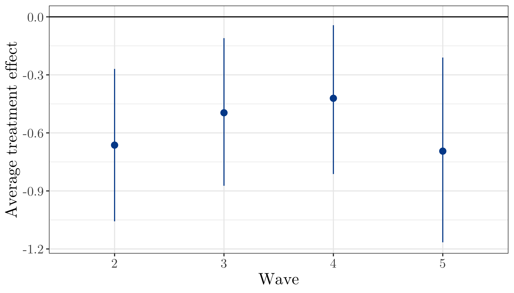
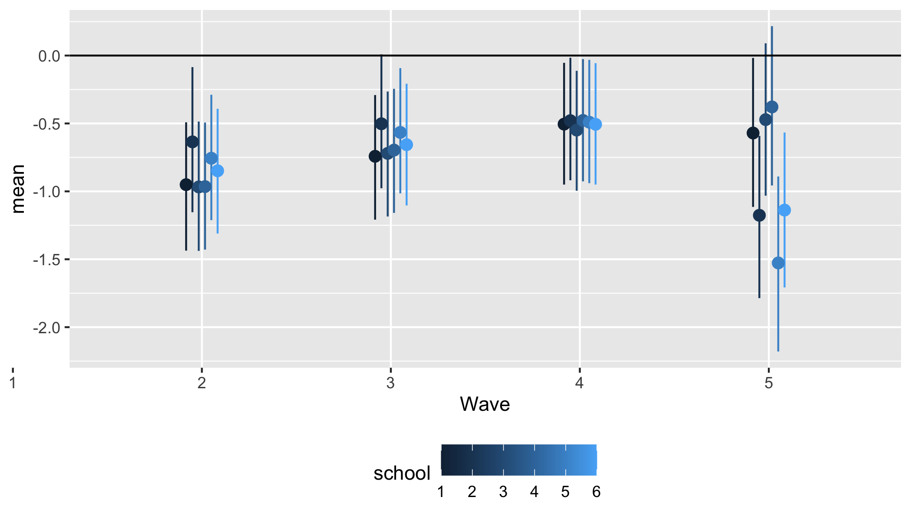
```
## Satisfaction with the class
\label{sec:results-class}
Averaging over all schools shows similar developments of the satisfaction with the class in the treatment and the control group (Figure&nbsp;\@ref(fig:sat-class-pred)). Both of them drop sharply in the first two periods and then remain on a level of around seven with the treatment group generally showing slightly lower satisfaction levels than the control group. The similarity between the groups leads to treatment effects that are close to zero in all of the waves (Figure&nbsp;\@ref(fig:class), left plot).
When looking at each school separately, it stands out that in school 1 and 2, it is the students in the treatment class that are on average happier than the ones in the control group. The treatment effects across schools are represented in (Figure&nbsp;\@ref(fig:class), right plot). The strikingly positive effects in wave 2 in schools 2 and 3 appear because in both cases the control group becomes more satisfied with friends while the treatment group becomes less satisfied (Figure&nbsp;\@ref(fig:sat-class-pred-across-schools)).
```{r class, echo=FALSE, fig.cap= c("Treatment effects - satisfaction with the class", "left: average school, right: across schools"),  fig.show = "hold", out.width = "50%", fig.align = "default"}
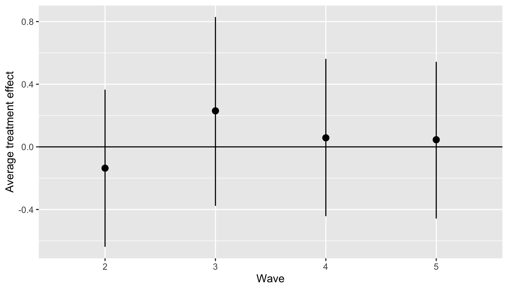
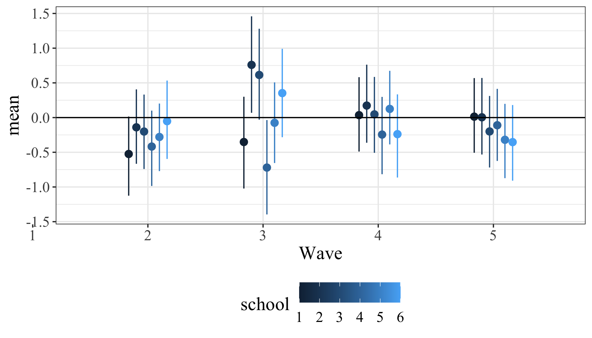
```

## Satisfaction with the school
\label{sec:results-school}
The level of satisfaction with school is quite volatile throughout the time of the project. There is a pattern observable in the control group which shows that students are more satisfied with school at the beginning and at the end of a school year and less satisfied in between, with an overall general trend to be less satisfied. The students in the treatment group generally show a level of satisfaction of more than eight and show values between 7 and 7.25 in all the other periods (Figure&nbsp;\@ref(fig:sat-school-pred)). The drop from wave 1 to wave 2 can be seen in each of the in each of the observed classes. But while in school 5 it continues to drop in the remaining waves with the lowest value in wave 5 being only 6. In all the other schools satisfaction with school goes up after that initial drop and eventually levels between 7 and 8. Figure&nbsp;\@ref(fig:school) shows the treatment effects for the average school satisfaction over the schools (left plot) and across the schools. The effects lie close to zero but have a tendency to be negative.
```{r school, echo=FALSE, fig.cap="Treatment effects by area of satisfaction for average school",  fig.show = "hold", out.width = "50%", fig.align = "default"}
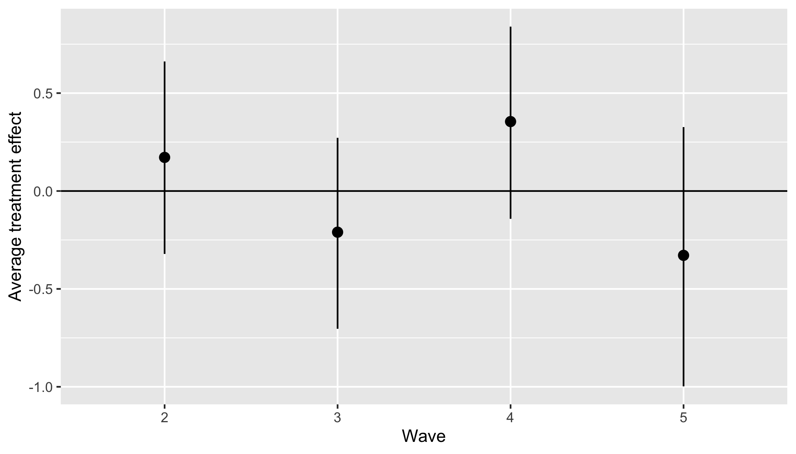
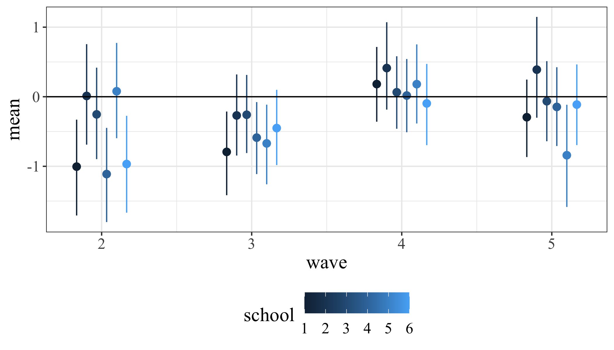
```

# Conclusion
\label{ch:conclusion}
```{r random-pid, echo=FALSE, echo=FALSE, out.width = "80%", fig.align='center', fig.cap="Excerpt from questionnaire"}
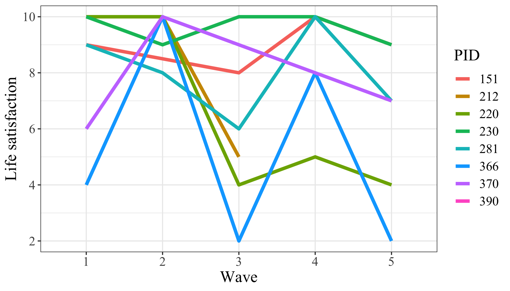
```
Is the common trend assumption too strong? There are no pre-treatment observations that compare the groups. Can we compare the classes???

The assumption of a normally distributed effects is hard to justify, considering the distribution of life satisfaction as it is in wave 1. (Figure&nbsp;\@ref(fig:hist-lsat)). The peaks for values of life satisfaction at 5 and at 10 do not really represent a normal distribution. The main reason for the use of normal distributions is mainly mathematical tractability. However, if the family of Bayesian models is inappropriate, Bayesian answers can be quite misleading [@Rubin1981, p. 394]

<!-- REFERENCES -->
\clearpage

# References {-}

\singlespacing

\setlength{\parindent}{-0.5in}
\setlength{\leftskip}{0.5in}
\setlength{\parskip}{8pt}
\noindent

<div id="refs"></div>


<!-- APPENDIX -->

\clearpage

# (APPENDIX) Appendix {-} 

```{r questionnaire, echo=FALSE, echo=FALSE, fig.cap="Excerpt from questionnaire", fig.show = "hold", out.width = "80%", fig.align = "center", fig.pos="H"}

```
```{r sat-friends-pred, echo=FALSE, fig.cap="Predicted satisaction by area for average school", fig.show = "hold", out.width = "80%", fig.align = "center", fig.pos="H"}
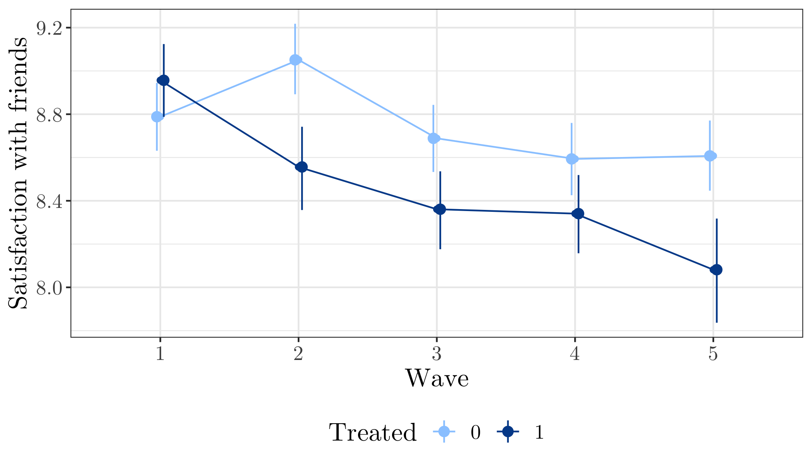
```
```{r sat-friends-pred-across-schools, echo=FALSE, fig.cap="Predicted satisaction by area for average school", fig.show = "hold", out.width = "80%", fig.align = "center", fig.pos="H"}
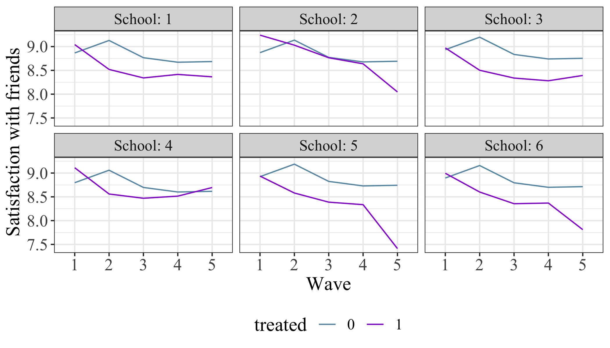
```
```{r sat-class-pred, echo=FALSE, fig.cap="Predicted satisaction by area for average school", fig.show = "hold", out.width = "80%", fig.align = "center", fig.pos="H"}
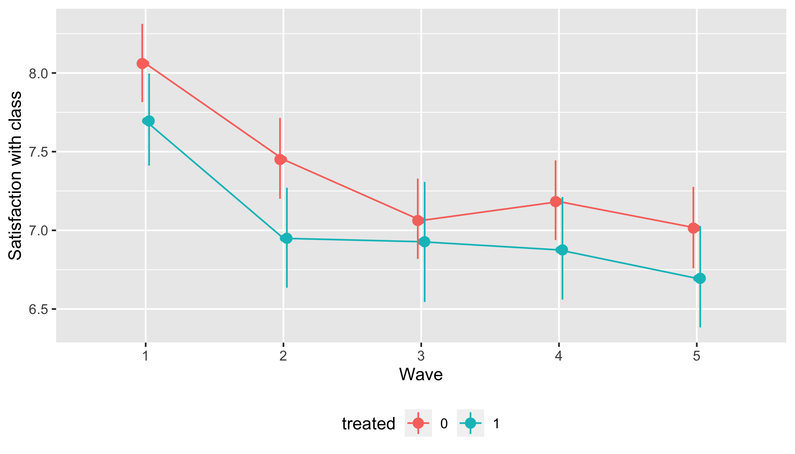
```
```{r sat-class-pred-across-schools, echo=FALSE, fig.cap="Predicted satisaction by area for average school", fig.show = "hold", out.width = "80%", fig.align = "center", fig.pos="H"}
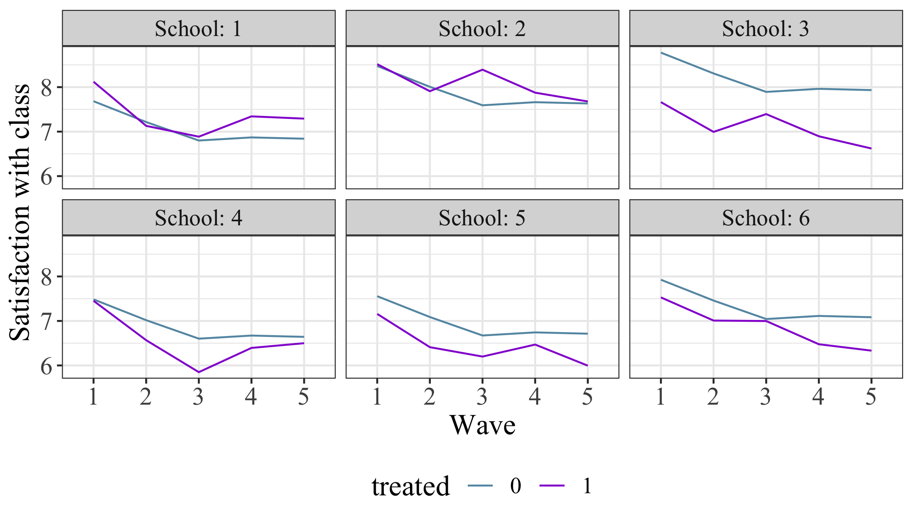
```
```{r sat-school-pred, echo=FALSE, fig.cap="Predicted satisaction by area for average school", fig.show = "hold", out.width = "80%", fig.align = "center", fig.pos="H"}
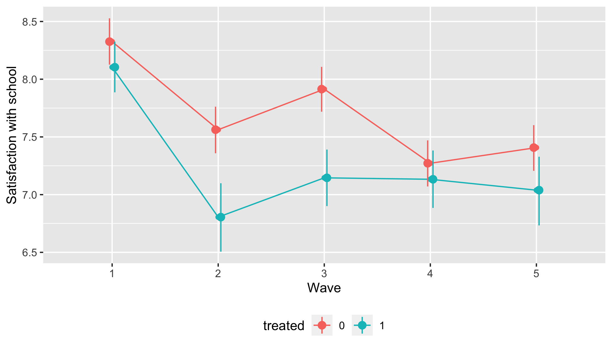
```
```{r sat-school-pred-across-schools, echo=FALSE, fig.cap="Predicted satisaction by area for average school", fig.show = "hold", out.width = "80%", fig.align = "center", fig.pos="H"}
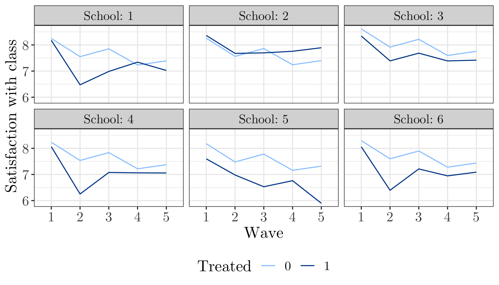
```

Example of nice appendix in @Hille2014

# Declaration of authorship {.unlisted .unnumbered}

I hereby declare that I am the sole author of this master thesis and that I have not used any sources other than those listed in the bibliography and identified as references. I further declare that I have not submitted this thesis at any other institution in order to obtain a degree.


