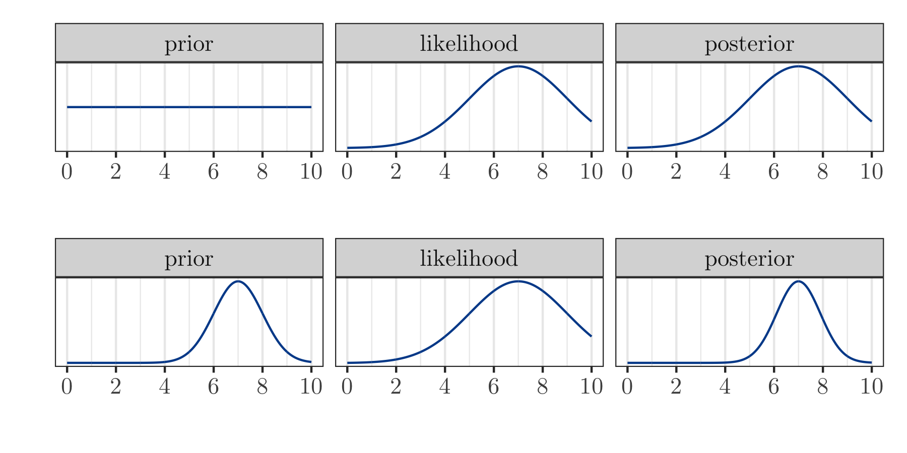
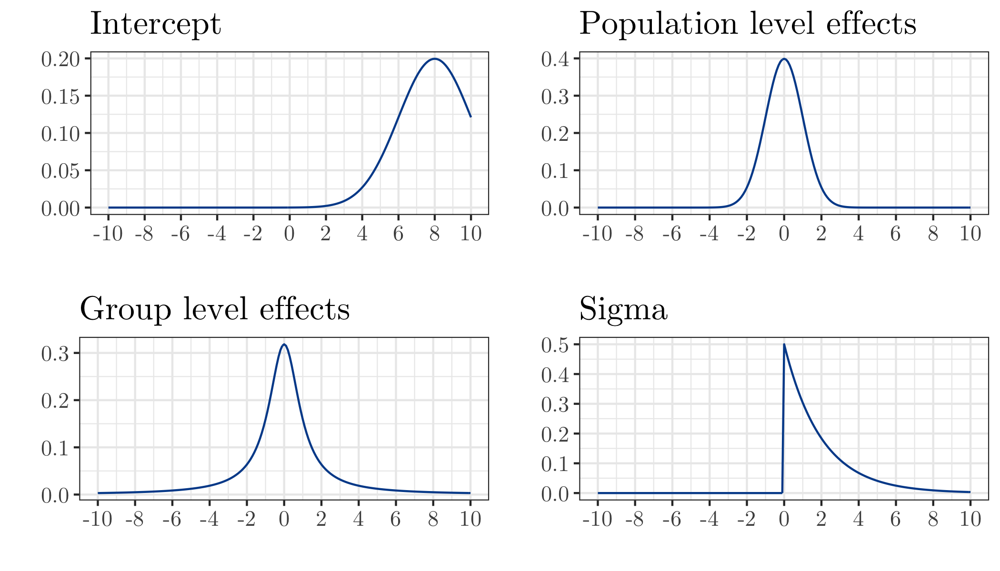
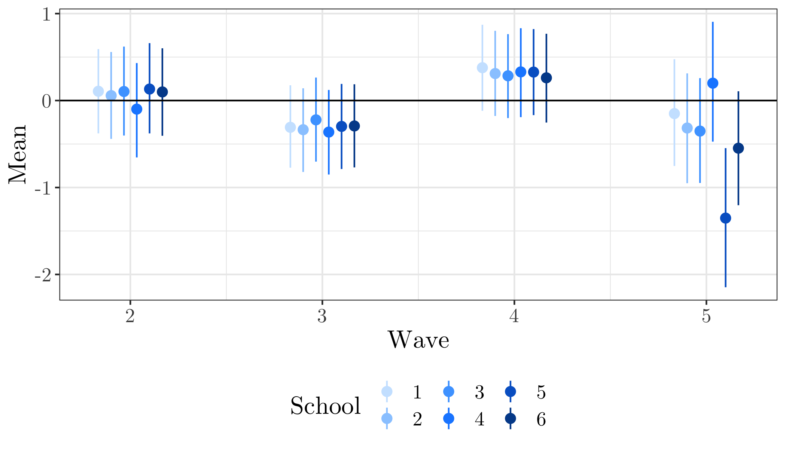

```{r setup, include=FALSE}
knitr::opts_chunk$set(echo = TRUE, concordance = TRUE)
library(summarytools)
library(kableExtra)
library(stargazer)
```

<!-- TITLE PAGE -->

\begin{titlepage}
% Titlepage (fold)
\thispagestyle{empty}%
\begin{center}
\renewcommand{\baselinestretch}{1.0}\normalsize %
\textbf{
The effect of music education on students' well-being. Empirical evidence from a field experiment}\\[1cm]
Preliminary - work in progress \\[1cm]
This draft: \today \\[1cm]
% Comments welcome \\[0.25cm]
% \renewcommand{\baselinestretch}{1.5}\normalsize
Vera Schramm \\
University of Halle-Wittenberg \\[0.75cm]
% \today
 \end{center}


\end{titlepage}

<!-- ABSTRACT -->

 \renewcommand{\baselinestretch}{1}\normalsize

 \textbf{\normalsize Abstract}
Our analyses, following the discussion above, address two central questions
using a cultural capital framework. First, who participates in music
both in and outside of school, and to what extent is such involvement
stratified by social class, race/ethnic, and gender status? Second, and relative
to the more central question discussed at the outset, do various forms of
music involvement influence academic achievement, even after accounting
for prior achievement, background statuses, and other educationally meaningful
investments? Relatedly, to what extent might disparities in music
involvement shape group-specific gaps in achievement that have been so well
documented elsewhere?

<!--  \pagenumbering{roman} -->
<!-- \setcounter{page}{2} -->

<!-- TOC -->

\clearpage
\tableofcontents

<!-- BODY -->

<!-- \pagenumbering{arabic} -->
\clearpage
\doublespacing
\pagestyle{plain}
<!-- \setcounter{page}{1} -->

<!-- INTRODUCTION -->

# Introduction
\label{introduction}

In German schools, and music are often considered less important than the typical hard subjects like math and science. Due to a lack of teachers, many classes are cancelled, of which 80\% are in the subject of music. In Saxony we see ongoing efforts to eliminate the subject of music from the curriculum entirely. Furthermore, the quality of music lessons suffers from the fact that 80\% of its teaching staff are foreign to the subject [@Moeller2017].

Music education experts are concerned about this development. According to them, music should not be regarded as a private matter. Regardless of their socioeconomic background, school children must have the opportunity to receive high level music education because it is as important for a proper education as literacy and mathematics [@Gebert2018]. Prof. Höppner, the General Secretary of the German Music Council (Generalsekretär des Deutschen Musikrats), said in an interview that music education helps to build stable self-esteem by learning to access ones own emotions [@Stoverock]. He points out that the phase where music can shape a young person explicitly well is completed by the age of 13. That stresses the importance of high quality music education for students in pre- and secondary school.

The Federal Association of Music Education (Bundesverband Musikunterricht (BMU)) has set up the "Agenda 2030" to initiate an improvement in music education. Similar to Höppner [@Stoverock], they consider music education as valuable and essential for a social and cultural society. It encourages children to take responsibility and to increase their sense of self-determination [@BundesverbandMusikunterricht, p. 2].

In views of this broad societal debate, empirical research has concentrated on the effect of music education on cognitive abilities (school grades and IQ in particular). Not so much effort was spent on observing the connection of music and well-being. This seems surprising because life satisfaction and happiness have become central research areas in the social sciences. My thesis addresses this research gap and investigates the effects of music education on children's overall life satisfaction and on satisfaction in specific areas, namely satisfaction with the class, satisfaction with friends, and satisfaction with the situation at school. It analyzes music education in the classroom where fifth and sixth grade students have one additional hour of music education per week. The project is called "klasse.im.puls" and it promotes the establishment of musical training in secondary schools in Bavaria. The program was implemented with the intention to give every child the opportunity to learn how to play an instrument. Additional positive outcomes were expected: an increase in self-confidence and social competence, as well as a reduction in violent behavior ^[For more information:]. The project was supervised by the FAU Erlangen-Nuremberg Music Teaching Department in collaboration with the Bavarian Ministry of Education.
My analysis focuses on the change in the overall life satisfaction and in satisfaction within specific areas reported by the students over the course of the project. The term of *life satisfaction* refers to a cognitive evaluation of a person's reaction to his or her life in contrast to *affect*, an ongoing emotional reaction. Combined, LS and affect yield subjective well-being [@Diener2009, p. 71]. I will approach the problem by using a multilevel model, that accounts for differences on the level of the individual student, on the level of the class and on the school level. I do this by using Bayesian inference...

The interest in life satisfaction as an outcome of the music project stems from the idea that higher values of LS come with many benefits. Among other positive correlates, adolescents reporting very high levels of LS are less likely to be affected by depression, anxiety, negative affect and social stress compared to adolescents with very low life satisfaction. Also, they achieve higher SEAs and demonstrate higher mean scores of school satisfaction [@Proctor2009a, p. 928; @Gilman2006, p. 316]. These results go in line with a study by @Suldo2004 [p. 94] that shows that LS could be a moderating variable in predictions of the development of psycho-pathological behaviors. Low life satisfaction may be an indication for externalizing behavior problems in the future. When life satisfaction is on a higher level, those behavior problems are less likely to occur [@Suldo2004, p. 100] The authors conclude that life satisfaction might operate as a buffer against the development of subsequent externalizing behavior problems "in the face of stressful life events" [@Suldo2004. p. 101]. @Kim2003 add to the discussion that externalizing behavior problems in turn lead to more stressful life events. That reciprocal interrelation of stressful life events and externalizing problems (reported as delinquent behaviors) leads to unhealthy dynamics of increasing stress and behavior problems. If higher LS leads better coping mechanisms with stressful life events, these dependencies could be reduced.
LS is also positively correlated with children having higher measures of self-esteem, internal locus of control, and extraversion [@Huebner1991, 107]. These features help in building a solid foundation for later life. On the other hand, dissatisfaction with life is associated with adolescents having poor mental health (like anxiety and neuroticism) and physical health and being exposed to a higher risk of considering or attempting suicide [@Valois2004, 94; @Huebner1991, 107]. Furthermore, @Zullig2001 [284-185] show that adolescents reporting low levels of overall life satisfaction are more likely to use drugs and alcohol earlier in life and in higher amounts than adolescents with medium or high life satisfaction.

Considering the statement of Höppner, one would expect the project to positively effect students' life satisfaction. Evidence for this relation would lend credibility to the project and support its continuation. It could also stress the importance of music education and signal the Ministry of Culture to keep music education in the curriculum and work on its implementation in federal states alongside Bavaria. However, there will be no in-depth investigation of the analysis of any observations. Describing possible reasons for certain outcomes must be left to music and education experts...

The structure of my thesis is as follows: At first there will be an overview of the current literature on music effecting students' lives. Next, the project and the dataset will be explained. Descriptive statistics are presented alongside a detailed diagnostic on pre-treatment differences in the treatment group compared to the control group. The estimation strategy is presented in chapter four, following the results in the fifth chapter. Finally, chapter six concludes and discusses.


*Gute Einleitung bei @Southgate2009*
<!-- LITERATURE REVIEW -->

# The role of music in childrens' lives
\clearpage
\label{ch:roleofmusic}
With regard to the effect of music on students' lives, most of the researchers are interested in academic outcomes and intelligence among students who are actively involved in music. Generally, there is the predominant perception of a positive link between music and cognitive abilities. @Osborne2015 [14] observed improved math skills and higher subjective well-being scores in children that were part of a music project. He also found them to have a better self-control over impulsive behavior. @Yang2015 (p. 385),@Wetter2008 (p. 372) , @Hille2014 (p. 62), and @Guhn2019 (p. 316) present evidence that children playing music have better grades at school. But this conclusion is not very meaningful as all of these studies follow a correlational design and do not allow for causal inference.  Nonetheless, the very optimistic and as we will see not quite realistic belief has prevailed that playing music causes children to achieve better results at school. This conclusion needs to be *revised*. In an extensive review of the available evidence concerning associations between music and cognitive abilities, the picture is not so clear any longer [@Schellenberg2013]. Small associations between music training and mathematical ability in correlational and quasi-experimental studies might result from individual differences in general intellectual ability (p. 527). The available evidence simply indicates that high-functioning children (i.e., higher IQ, better performance in school) are more likely than other children to take music lessons and to perform well in mathematics and other tests of cognitive ability (p. 534). This fits with the @Hille2014 study where the outcome difference in cognitive skills between musically active and inactive children reduces greatly when holding constant observable characteristics. An other plausible interpretation of study outcomes that fail to detect a causal relationship comes from @Wetter2008. He points out the possibility that the relationship is explained by affluent parents being more likely to afford music lessons for their child and thus, the socio-economic background may be the cause of higher performance at school. Despite the weakness of the above studies to draw causal inference, there is slight evidence that there may be a causal direction *from* music training *to* cognitive abilities in a study by @Schellenberg2004. He compares two treatment groups who receive piano lesson and voice lesson respectively to a control group in which the children have drama lessons. Random assignment to the different conditions allowed for inference that music lessons caused small increases in cognitive abilities (namely larger increases in full-scale IQ). However, this does not preclude the possibility that high-functioning children are more likely driven to play music. The misconception of music being a predictor for academic achievement is also discussed by @Southgate2009 (p. 17) who states that music is rather a mediator, to some degree, of family background and student status. Results from a meta-analysis, suggest that music training does not reliably enhance children and young adolescents' cognitive or academic skills, and that previous positive findings were probably due to confounding variables, such as placebo effects and lack of random allocation of participants [@Sala2016, p. 64]. The effect size was reduced in studies that applied a proper study design (random allocation of participants to the treatment group and comparison to an active control group). With respect to the mathematical outcomes, the only study comparing a music training to an active control group and with random allocation of the participants to the group [@Mehr2013] found a negative effect size. These considerations are in clear contrast to the popular perception that music training enhances any non-music related cognitive skill.

However positive outcomes due to music could be found outside academics. The Norwegian psychologist and musicologist Even Ruud who in 1978 was the head of the first music therapy training performed extensive studies on music and identity. He states that cultural activities, explicitly music, can "contribute to a feeling of quality of life and the subjective sense of health." (p. 96). In an experimental study by @CostaGiomi2004 a positive causal effect was detected of piano lessons on self-esteem [144] but she did not find an effect on math computation scores. One especially popular project that was conducted to improve children's lives is Venezuela's National Music Education Program "El Sistema". It is a large scale social music education program established by José Abreu in the 1970s. 300,000 children are equipped with instruments every year and receive regular after-school lessons and are playing in orchestras. The initial goal was to prevent children from using drugs and being involved in violence and crime which was successfully achieved. Being in orchestras also enhanced social behavior of the students through greater concern for others and their own well-being [@Uy2012, 13]. However positive effects go far beyond keeping adolescents away from drugs and violence: El sistema teaches the participating students to "reflect and act upon the world in order to transform it" [7]. Playing in an orchestra means joy, motivation, teamwork, the aspiration to success [6]. The students pick up management and organizational skills and responsibility due to many roles and rules that they need to follow to sty in the program[p. 10]. Also, being in an orchestra gives the students the change to conceptualize themselves as part of something much larger and greater (p. 11) and they learn to express greater concern for others' and their well being (p. 13). El Sistema became internationally popular and was replicated in several countries. @Osborne2015 reviewed the outcome of El Sistema inspired projects in Australia and found significantly higher subjective well-being scores in the participating group (p. 14). Students from the music program also had better self-control over impulsive behavior (p. 15). However, other studies come to contrary conclusions and fail to show a significant effect of music participation on well-being, social skills, emotional intelligence or self-esteem [@Schellenberg2011a, p. 190 association; @Portowitz2009, p. 121]. Again, findings are diffuse and therefore interpretation of any results needs to be with caution.

The takeaway from this section is we must be very careful when drawing causal conclusion and we have to adjust the methods.

This paper complements existing literature by using different music indicators and estimation strategies to provide further insight on the relationship between music and education as well as the potential sources of endogeneity.


<!-- DATA -->
\clearpage
# Data
\label{ch:data}
In this section, I will first give more background information on the KIP project, before describing the data themselves. After general summary statistics, there is a section about handling potential issues arising with differences in the treatment and control group.

## The project
\label{sec:project}
The data come from the years 2012-2014 when KIP was conducted in six different secondary schools (Mittel- und Realschulen) in Nuremberg. Generally, there are different types of implementations of the KIP project (e.g. choir, brass band, string orchestra) among which the rock band model was implemented in all of the schools that are subject to this study. Probably due to parents' and students' music preferences, this type has been the most popular. A school had to fulfill certain criteria in order to get support for the project. For example, the school had to make sure that there was a full-time music teacher who was qualified to carry out the  project. That person was trained to lead a band class and attended yearly meetings with other music teachers to share experiences. This way, it can be assured that the treatment in each school looked pretty much the same and there were no noteworthy differences in the way the teachers arranged the music lessons in the band classes. Participating schools were supported in acquiring equipment and instruments to implement ensemble music class teaching. In each school was a band class and a control class. The band classes received three music lessons per week, whereas the control classes only received two lessons of regular music education. Music lessons in the treatment classes differed significantly from that in the control group. In the band classes, the teachers had a more practical approach and there was less theoretical music education than in the control group. The three music lessons per week were split into a) Instrumental instructions in small groups, b) ensemble playing, and c) general music education (music theory or history). The latter was similar to how regular music education was implemented in the control group. Therefor not only the amount of music education is higher in the treatment group but also the way that music education is delivered differs a lot from normal music lessons in a way that it is more practical and with better equipment. The students played concerts in regular intervals and were thus able to share what they had learned. In five different points of time, the students were asked to fill in a questionnaire:

wave 1: Beginning of 5th grade (pre-treatment)
wave 2: Mid of 5th grade
wave 3: end of 5th grade
wave 4: mid of 6th grade
wave 6: end of 6th grade

## Variables
\label{sec:variables}
The sample that is studied has a hierarchical structure with three levels: (Ideally) Each student is observed multiple times, ideally at five points throughout the project if he was present every day a questionnaire was given to the students. The different time periods are level one. The students themselves are level two and as the students are nested within schools, the third level is the school level. More details on the specific variables follow now:

### Satisfaction
To measure life satisfaction and any area of satisfaction, I use a 11-point scale, with responds on a scale from 0 to 10. Life satisfaction is the variable of interest in my thesis, alongside with *Satisfaction with friends*, *Satisfaction with class*, and *Satisfaction with school*. An extract of the questionnaire can be found in the index. Measuring life satisfaction on a 0-10-scale is quite common in that field of literature [@Mellor2008 @Cheung2014} but also 7-point scales are found a lot [@Diener1985]. For the model, the satisfaction measures are assumed to be cardinal comparable both across and within individuals across time. There is broad consensus in the literature to interpret satisfaction responds as cardinally scaled [@iCarbonell2004]. Summary statistics about the different areas of satisfaction are presented in Table \ref{tab:mean}.

```{r mean LS, echo=FALSE}
sum_satisfaction <- readRDS("../results/sum_satisfaction.RDS")
knitr::kable(sum_satisfaction, digits = 2, booktabs = T, col.names = c("Variable", "Mean", "SD"), caption = "Mean satisfaction")
```
As already cited above in @Johnston2002, children tend to give values at the extreme ends of a scale. This is also what happened in the KIP sample: The histogram in Figure \ref{fig:hist lsat} shows a striking portion of the students indicating to have a life satisfaction of 10. Also, 50% of the students respond with a 5 on the scale. This might indicate the issue that children how did not understand what the question asked them to do or that were not able to make the transfer from their individual assessment of their life satisfaction to pair it with a number just chose 5 randomly, hoping that it was neither "right or wrong".
```{r hist lsat, echo=FALSE, echo=FALSE, out.width = "100%"}
knitr::include_graphics("../figures/lsat_bar.png")
```

### Treatment
The treatment is represented by a binary variable, indicating whether a student participated in the treatment ("1") or not ("0"). The treatment is conducted on the class level. All students in the same class are assigned the same indicator of whether or not they attend the treatment. Students did not change the class. Treatment also appears in the data set as an interaction term with each time period in that a treatment effect can be measured. Multiplying the binary indicator of treatment with the dummy variable for each period gives four indicators with the variable indicating 1 if the observation was in the treatment group and was made in the respective wave and 0 otherwise.

### Individual characterisitc background
In the first wave, students were asked to state their gender (Tick either *"Bist du ein Junge/ein Mädchen?"*). This question did not appear in subsequent waves which leads to the issue that children who were not in school on the day the first questionnaire was handed to them, appear as NAs in the sample. The same happened for migration background. To avoid drop out of too many observations in the estimation process, gender and migration background were manipulated as category variables and NAs were replaced by the category *unknown* This leads to the following distribution of time-invariant individual characteristics: Both the gender and the migration background is not known for around 20% of the total of 394 students.

The fact that it is an unbalanced panel that is studied should be considered more thoroughly. In Table \ref{tab:N Obs per wave and school} shows that the number of students in each class is varying over time, most severely in class five. The number of participants of the questionnaire drops by more than a third in wave 5 compared to the first period. The overall effect of this decline on the whole sample is shown in table \ref{tab:n_Obs_treat}. In the treatment group, their number of students decreases from 163 to 146 and in the treatment group from 154 to 141. This could be a reason to exclude school five from the observation completely as the attrition rate in the remaining schools is not that alarming.

```{r N Obs per wave and school, echo=FALSE}
n_obs <- readRDS("../results/n_obs.RDS")

knitr::kable(n_obs, booktabs = T, caption = "Number of observations")

```
As a third individual background variable, I included if a student had some musical experience before the project had started. I expected students who already played an instrument before or received private music lessons would be more drawn to the treatment class. Also, as I want to find out if the project made students more satisfied, any previous effects of music on satisfaction should be minimized.

```{r N Obs, echo=FALSE}
n_obs_treat <- readRDS("../results/n_obs_treat.RDS")

knitr::kable(n_obs_treat, booktabs = T, caption = "Number of observations")

```

## Pre-treatment differences

The decision who attended the treatment group was made before the entrance to grade 5. Parents could choose to put their child into a music class. Therefore, the experiment is not fully randomized. Children who were already into music in the first place might have been more likely to have chosen the music class. Also the decision can be a a consequence of parental and socio-economic background of the student. To have a better idea of possible differences between the treatment and the control group, I computed standardized mean differences:

The standardized mean differences are not a reason of concern in this setting. For most of the observed variables, there are no notable differences between the treatment group and the control group. However, as already suspected, there are differences in prior musical knowledge. Among the treated, there are relatively more children who have music as a hobby before the project has even started. Of the 87 students who answered with "yes" to the question if music was their hobby, only 24 were assigned to the control group and the remaining 63 students attended the band classes. Also, the duration of making music is very different in the two subgroups. In the Treatment group, 56% are practicing at least 30 min, while in the control group that share is only 35%. However, the model addresses this issue by applying a difference-in-difference approach to estimate the causal effect of additional music lessons on students' well-being. Possible differences in the control group and the treatment group are not a problem for inference.

```{r std mean diff, echo=FALSE}
extract_smd <- readRDS("../results/extract_smd.Rds")

knitr::kable(extract_smd, booktabs = T, caption = "Standardized mean differences", col.names = c("treated = 1 vs 0"))

# https://cran.r-project.org/web/packages/tableone/vignettes/smd.html
```


## Measuring LS in children
\label{sec:measurement}
An extensive amount of research was done on adult life satisfaction and on methods how to measure it. From that we know that not only is life satisfaction a result of life circumstances but it determines outcomes in several areas like health, ... (see Firsch 1999 for a review (suldo and huebner, ß. 94))

Even though, the amount of research on

To investigate ones quality of life, research uses both objective and subjective indicators. Typical objective indicators are the income levels, crime rates, and access to medical services -- measures that are external and quantifiable. Subjective indicators on the other hand comprise subjective evaluations of ones' individual life circumstances [@Gilman2000, 178]. Only a modest relation between both measures was found which indicates that each approach carries unique information that are relevant for a comprehensive understanding of overall life quality *(Veenhofen, 1996)*. Over time, measurement methods for subjective indicators have evolved leading to substantial growth in the life satisfaction research. However, for a long time, most of the measurements were designed to assess adults' life satisfaction. Only recently, investigating correlates of life satisfaction in adolescents has begun. One reason why life satisfaction research in children was put off for a long time are probably that measuring life satisfaction in children is more challenging than for adults. Instruments for assessing children's subjective life satisfaction reports have been less intensively developed which is probably due to the fact that a Likert-type ratings scale is more difficult to use for younger children than for adolescents [@Johnston2002, 28]. For example, younger children or children with poorer readings skills are less able to respond appropriately to negative items on questionnaires and this effect biases the interpretation of children's responses [@Marsh1986, 45]. It is also common for children rating their subjective life satisfaction to show elevated extreme scores. As children become older, this tendency shrinks and they are more capable of providing graded ratings in between the two extremes. These results have potentially substantial implications for the interpretation of self-report ratings form children *this tendency might have an erroneous and invalid impact on the interpretation of children's self-reports*[@Johnston2002, 33-34]. When dealing with self-reported life satisfaction in children, it is crucial that the respective child fully understands the question in order to give a valid response [@Gluskie2012; @Tomyn2016]. One must make sure that a child is old enough to know how to use a satisfaction scale. This requires children to distance themselves from the current situation, cognitively evaluate their life satisfaction (considering all relevant areas of life) and rate the degree to which certain items on the scale apply to them. This requires abstract thinking, which children develop in early adolescent years (10-14 years) [@Gluskie2012; @Piaget1955; @Piaget1969]. @Gilman2000 have reviewed five different (both unidimensional and multidimensional) measurements explicitly developed to asses adolescents' life satisfaction ^[The Students' Life Satisfaction Scale [@Huebner1991a], the Satisfaction With Life Scale [@Diener1985], the Perceived Life Satisfaction Scale [@Adelman1989], the Comprehensive Quality of Life Scale - School Version [@Cummins1997; @Gullone1999], and the Multidimensional Student's Life Satisfaction Scale [@Huebner1994]]. The authors evaluated those measures in terms of validity and reliability and found all of the scales to be appropriate for research with adolescents [181-188]. The demographic characteristics of the available samples show that all of the adolescents observed were older than 12 years. Therefor it remains unclear if children younger than that age are able to report valid satisfaction.
An other instrument was developed more recently by [@Cummins2005] which is the Personal Well-being Index (PWI-SC). Again, studies demonstrated reliability for this instrument as well [@Casas2011; @Casas2015; @Tomyn2011a; @Tomyn2019]. But also in those studies, all of the adolescents were at least 12 years of age, mostly even older. There is only very little evidence on the psychometric properties of the PWI-SC for children below the age of 12.
One of them is @GonzalezCarrasco2016 [p. 70] who applied the instrument for children as young as only 9 years and also found adequate fit of the data.
On the other hand, @Tomyn2016 conducted a study with children aged 10-12 and concluded that subjective well-being data of children must be interpreted with caution. They also show that response bias towards the extreme positive end of a scale is higher with decreasing age. The authors do not recommend using the PWI-SC for children younger than 12 years. As for the specific sample, the PWI-SC did not serve as a valid instrument for measuring the SWB.

In conclusion, measuring life satisfaction in children is more challenging than for adults and is still in progress. It is advisable to check the validity and reliability of their data when testing children. Considering, the majority of the children from the KIP project are 10 year sold in wave 1 (72% of those participating in wave 1), they might be just too young to give valid responses when asked about their life satisfaction. This must be kept in mind when evaluating the significance of the results.

# Identification strategy
\label{sec:identification}
In the following, I will explain how hierarchical models are best to navigate between underfitting and overfitting (fit to sample always - not true of multilevel models - improves as we add parameters.


## Multilevel modeling
To assess the effect of the music treatment on the student's life satisfaction, I make use of multilevel modeling. As mentioned in \ref{ch:data}, the sample is structured hierarchically with students, nested within schools, observed in several time periods wherefore using a simple nonhierarchical model would be inappropriate. It would tend to underfit when there are only few parameters and t overfit the data when too many parameters are included. Though the latter would fit the existing data well but it would be very poor in making predictions for new data @AndrewGelman2013, 101 Multilevel models, also known as hierarchical models, involve predictors at different levels of variation. In the KIP setting that means that it is possible to measure different effect sizes throughout time in each of the schools. It is likely that schools differ from each other and so the way the students react to the treatment differs as well, depending on the school they are in. This helps finding out if the intervention was more effective in some schools than in others to learn what could be improved in the future. In a classical regression, assigning varying effects for each group is done using interaction terms or running separate regressions for each subgroup of the sample. However, this has the disadvantage that estimates can be very imprecise, in particular when there are only few observations in one group. Estimating parameters for each group separately is referred to as no-pooling because each group is observed independently without considering the rest of the sample. However ignoring the hierarchical structure, which is then called complete pooling, is also not recommended, because effects that are actually true might disappear. Both approaches have downsides for different reasons but they can be useful preliminary estimates, eventually leading up to what is known as partial pooling that comes out of a multilevel analysis. Therefore I will illustrate both the extremes, complete pooling and no pooling in the following before I get to the details of partial pooling.

* *Complete pooling:*
Figure \ref{fig:complete pooling} shows the estimated treatment effects in each wave when completely pooling the data. The population of schools is assumed to be invariant. This ignores the fact that schools are different and assigns the same intercept to each of the schools. If done like this, there is the risk of ignoring important variation in how schools correspond to the treatment [@Mcelreath2020, 416]. The total sample mean underfits the data, meaning that the model is insensitive to the details in the data and is learning too little from it. Ignoring the group-level variation is very likely misleading. \ref{fig:lsat_vs_time_school_treated} plots the dynamics of mean life satisfaction for each school individually and it becomes clear that the development of life satisfaction in the treatment group over time differs noticeably.
```{r complete pooling, echo=FALSE, echo=FALSE, out.width = "100%"}
knitr::include_graphics("../figures/complete_pool.png")
```
```{r , echo=FALSE, echo=FALSE, out.width = "100%"}
knitr::include_graphics("../figures/lsat_vs_time_by_school_treated.png")
```

* *No-pooling:*
The opposite is true for no-pooling information. Then the model is very sensitive to the details in the data, it is learning too much from it. To visualize this, I run panel linear regressions for each school separately. The results are presented in \ref{fig:no_pool}. 
```{r no pooling, echo=FALSE, echo=FALSE, out.width = "100%"}
knitr::include_graphics("../figures/no_pool.png")
```
The no-pooling approach includes the assumption that the schools are completely different and on school cannot tell anything about the other schools. This is equivalent to the variation among schools being infinite which is certainly not the case. Schools are different in some ways for sure but they are also very similar in in the way that each school helps to estimate the treatment effect in other schools. One should choose a model that this. This is exactly what partial pooling is attempting.

* *Partial pooling:*
Multilevel models can be a solution by representing a compromise between the two extremes of no-pooling - Running separate regressions for each group and complete pooling - ignoring variation between groups. When partially pooling information, both similarities and differences among groups are comprised. Partial pooling uses all the data available to perform inference for groups instead of just using local information which is especially useful when there is only a small number of observations in each group. The group estimates are supported to the extend of the whole data set and are not being limited to the number of observations per group. These estimates are less underfit than the grand mean and less overfit than the no-pooling estimates. As a consequence they tend to be better estimates of the true per-school means (mcelreath p423). This will be especially true when there are only few observations in one class (as for examples in school ... wave ...) because then the no-pooling estimate will be overfit significantly. The difference between no-pooling and partial pooling becomes smaller, the more observations there are per cluster. The partial pooling produces noticeably better estimates and therefore will be used for my estimation. There are different tools to create a model that partially pooles information. I will use a Bayesian framework Since multilevel models have natural Bayesian representation (elreath p143) (Gelman & Hill p143)

Multilevel modeling works well for drawing causal inference but also for prediction and descriptive modeling [@AndrewGelman2013, 6]. A multilevel model is a linear model in which parameters are given a probability model. @Mcelreath2020 (p. 14) suggests to think of parameters as a placeholder for a missing model. That probability model itself has parameters called hyperparameters which are also estimated from the data. In other words, they are parameters for parameters.Technically, there is no limit to the number of levels, however infeasable computation and ability to understand the model are in practice a restriction. Though multilevel models are more complicated, it is worth using them because they reduce overfit as new parameters are added.

## Bayesian inference
*"Bayesian inference is the process of fitting a probability model to a set of data and summarizing the results by a probability distribution on the parameters of the model and on unobserved quantities such as predictions of new observations"* (gelman etal p1)
To set up what will follow in the next chaper about the explicit estimation, general terms from Bayesian inference are explained and formally written down. The notation comes from Gelman etal(chapter 1).
Unobservable vector quantities of population parameters of interest are denoted by $\theta$, $y$ is reffered to as the observed data, the life satisfaction so to speak, and $\tilde{y}$ are the unknown quantities (a new school...prediction.) Bayesian statistical conclusions about a parameter $\theta$, or unobserved data $\tilde{y}$ are not made in specifying point estimtaes but they are made in terms of probability statements, expressed as $p(\theta|y)$ or $p(\tilde y|y)$ to show that these probability statements are conditional on the observed values of $y$.
To make a probability statement about $\theta$ given $y$, a joint probability distribution for $\theta$ and $y$ is needed. The joint probability function is  the product of two densities: the prior distribution $p(\theta)$ and the sampling distribution $p(y|\theta)$. Applying Bayes' rule yields the posterior density $p(\theta|y)=\frac{p(\theta,y)}{p(y)}=\frac{p(\theta)p(y|\theta)}{p()y}$,
where $p(y)=\sum_\theta{p(\theta)p(y|\theta)}$, and the sum is over all possible values of $\theta$ (or $p(y)=\int p(\theta)p(y|\theta)d\theta$ in the case of continuous $\theta$).
To make predictive inferences, a similar logic is applied:
The distribution of the unknown but observable $y$ is
$$p(y)=\int p(y,\theta)d\theta=\int p(\theta)p(y|\theta)d\theta$$, which is referred to as the prior predictive distribution. It is not conditional on previous observations  of the process, and it is a distribution of some observable quantity.
From the same process, $\tilde{y}$ can be predicted after observing the data $y$.
The distribution of $\tilde{y}$ for example of future measurements, is called the posterior predictive distribution. It describes a prediction for an observable $\tilde{y}$ conditional on the observed $y$:
$$p(\tilde{y}|y)=\int p(\tilde{y},\theta|y)d\theta \\
= \int p(\tilde{y}|\theta,y)p(\theta|y)d\theta \\
= \int p(\tilde{y}|\theta)p(\theta|y)d\theta.$$
The equations express the posterior predictive distribution as an average of the conditional predictions over the posterior distribution of $\theta$. Given $\theta$, $y$ and $\tilde{y}$ are assumed to be conditional independent.
Having decided on a specific probability model, the data $y$ affect the posterior inference *only* through $p(y|\theta)$, the likelihood function.
Bayesian inference refers to statistical procedures that model unknown parameters (and also missing and latent data) as random variables. It starts with a prior distribution (more on that point in \ref{subsec:priors}) on the unknown parameters and updates this with the likelihood of the data, yielding a posterior distribution which is used for inferences and predictions (gelman and hill p143) (To my proof reading boyfriend: wie könnte man den Absatz schön umformulieren?)

# Estimation
\label{sec:estimation}
For model estimation I decided to use the brms packageby Bürkner (@Buerkner2017). It imlements Bayesian multilevel models in 'R' using the probabilistic programming language 'Stan'. It allows for individual prior specifications and facilitates incorporating prior distributions that reflect the users beliefs. The package is also suitable for assessing and comparing models with the Watanabe-Akaike information criterion and leave-one-out cross-validation

## The model
\label{subsec:model}
(Gelman p13)
In a first step, I will set up a full probability mode - a joint probability distribution for all observable and unobservable quantities in a problem. The model should be consistent with knowledge about the underlying scientific problem and the data collection process.
After that I will calculate and interpret the appropriate posterior distribution - the conditional probability distribution of the unobserved quantities of ultimate interest, given the observed data.
Finally, in a third step the fit of the model will be evaluated and the models' implications of the resulting posterior distribution is presented (how sensitive are the results to the modeling assumptions in step 1?)

\begin{align}
lsat & \sim {\sf Normal} (\mu_{ijt}, \sigma), \\
\mu_{ijt} & = \beta_0 + \beta_{1j[i]} T_i + \sum\limits_{l=2}^5\delta_{lj[i]} (T_{i} \times \text{Period}_{t}) + \lambda_t + \mu_{j[i]} + \alpha_{i} + \epsilon_{ijt}, \\
\beta_0 & \sim  {\sf Normal}(7,2), \\
Population-level effects & \sim {\sf Normal}(0,5), \\
Group-level effects & \sim {\sf Cauchy}(0,1), \\
\sigma & \sim {\sf Exponential}(0,5)
\end{align}

We have repeat measures and heterogeneity across clusters (McElreath). After all, schools are different but each school does help estimating the treatment effect in other schools.
The study of effectiveness of the music project, with the students in school $j$ having a certain unknown parameter vector $\theta_j$, it might be reasonable to expect that estimates $\theta_j$, which represent a sample of schools, should be related to each other. This is achieved in a natural way by using a prior distribution in which life satisfaction is viewed as a sample from a common *population distribution*. A key feature of such applications is that the observed data, $y_{ij}$, with student index $i$ within group indexed by $j$, can be used to estimate aspects of the population distribution of the $theta_j$'s even though the values of $\theta_j$ are not themselves observed. In contrast, hierarchical models can have enough parameters to fit the model well, while using a population distribution to structure some dependence into the parameters, thereby avoiding problems of overfitting.

I simultaneously investigate the treatment in six different schools. The analysis is restricted to wave 1 (pre treatment) and wave 2 (post treatment). The regression equation is:

The hierarchical structure in my model looks as follows:

where

* $y_{ijt}$ is the outcome of pupil $i$ in school $j$ at time $t$.
* $T_{i}$ is a binary indicator of whether or not pupil $i$ is in the treatment group. We model a fixed effect for the treatment group because the treatment takes place at the aggregate level (class). Therefore, bias in the estimate of the treatment effect may results from unobserved factors at the class level. 
* $\delta_{l2j[i]}$ is the treatment effect in wave $l$. The effect is allowed to vary across schools. 
* $\lambda_t$ denotes period fixed effects. 
* $\alpha_{i}$ models individual-specific unobserved factors. Individual heterogeneity is model because we have repeated observations for the same pupils over time. 
* $\epsilon_{it}$ is an error term.

(Simulation?)

For doing *blah* I use *blub* [ref]


## Prior distribution
\label{subsec:priors}
As stated above in \ref{sec:methodology} in a Bayesian framework parameters are not point estimates but they have distributions. The specification for these parameters are called prior distribution because they must be specified *before* the model is fit to data and it assigns them a probability to every possible value of each parameter to be estimated. If the specification is done properly, for all parameters in the model, a Bayesian model yields a joint prior distribution on parameters and data, and hence a prior marginal distribution for the data (Gabry p5). This process can be described as the prior distributions and data interacting to finally produce the posterior distribution. The posterior can be seen as a compromise between the prior distribution and the likelihood function. Therefore, the choice of the prior should be done carefully since it can determine the outcome severely. After identifying the type of data being described, creating a descriptive model with meaningful parameters, and defining a likelihood function, the next step is to establish a prior distribution over the parameter values (kruschke 110). The prior distribution indicates the believes about the distribution of each parameter without knowing the specific data. Depending on the choice of prior and the respective data set, the "compromise" favors one of them over the other. Flat priors or super-vague priors ($\sf {N}(0,1e6)$) are usually not recommended. They lead to a posterior distribution that is mainly influenced by the data which means that though the data set is very well described by the model, predictions are very poor. The model only "learned" about the distribution from the data because the prior did not carry any information. However if the prior has strong believes about the distribution of the parameters, meaning the prior distribution is sharply peaked, and there are only relatively few data, the posterior distribution is more influenced by the prior. Generally, weakly informative priors ($\sf{N}(0,10)$) are recommended because they help by providing a very gentle nudge towards reasonable values of the parameter (mcelreath p 299). If there is a reasonable large amount of data, they will dominate while the prior becomes less important. In case of not very meaningful data though, the "weakly informative prior" make up for it by strongly influencing the posterior inference. This relation is illustrated in \ref{fig:flat_peaked}. The upper row shows the posterior that appears when having a prior distribution $lsat \sim {\sf Normal}(5, 200)$. The standard deviation in this prior is huge and gives barely any useful information about the distribution of life satisfaction among the population. The shape of the posterior is almost identical to the one of the likelihood. The opposite is the case when the prior is highly informative. A normal distribution with parameters of $\mu = 5$ and $\sigma = 1$ suggests that life satisfaction is very narrow around the mean of 5. The prior is so sharp that the posterior distribution is noticeably influenced by the prior. Bayesian models with proper priors are generative models (Gabry p5)
```{r flat_peaked, echo=FALSE, out.width = "100%"}

```
A good prior also tackles the problem of overfitting which was discussed above. By choosing a skeptical prior. The term skeptical refers to the prior being skeptical about values outside the range of parameter values that are not reasonable. The most common skeptical prior is the regularizing prior which effectively reduces overfitting whil still allowing the model to learn about the regular features of a sample.
To decide on proper priors, I plottet the influence of different priors on the distribution of the outcome variable, life satisfaction. This helped me deciding on priors that influenced the oucome in a way that the largest part of the distribution was on a reasonable scale while extreme values are still possible. To begin with, the prior for the estimate is $N(7,2)$ (Figure...). Life satisfaction as it is measured in this setting spreads on a range from 0 to 10 with most of the responses in the upper third. For the standard deviation I chose $\sf {Exp}(0.5)$ which is wide enough for all values on the satisfaction scale to remain possible. For the population-level and group-level effects, I came to the conclusion that a weakly-informative prior of $\sf {N}(0,1)$ is best. To show this, I plotted predicted values from different prior predictive distributions:


made some prior predictive simulations as suggested by MacElreath. This method is useful for understanding the implication of a prior and is neatly executed by Gabry ( see full code...). It simulates predictions from a model, using only the prior distribution instead of the posterior distribution. Once priors are chosen, they imply a joint prior distribution of individual life satisfaction (elreath p85). This procedure is based on choosing priors conditional on pre-data knowledge of the data, on general facts so to say (elreath, p100). Only when this step is done, the model is applied to the data.


```{r lsat_predicted, echo=FALSE, out.width = "100%"}
knitr::include_graphics("../figures/lsat_predicted.png")
```
```{r chosen_priors, echo=FALSE, out.width = "100%"}

```
\clearpage
## Posterior distribution
\label{subsec:posterior}
For every unique combination of data, likelihood, parameters, and prior, there is a unique posterior distribution (elreath p36). This distribution gives information about the relative plausibility of different parameters, conditional on the data and model. The best way to interpret the resulting posterior distribution is by sampling from it. *So if we were to compute the sampling distribution of outcomes at each values of p, then you could average all of these prediction distributions together, using posterior probability of each values of p, to get a posterior predictive distribution*
sampling to simulate prediction
```{r post_dens_overlay, echo=FALSE, out.width = "100%"}

```
```{r post_pred, echo=FALSE, out.width = "100%"}
knitr::include_graphics("../figures/post_pred.png")
```

## Model validation

### Graphical MCMC diagnostic

# Results
\label{sec:results}
```{r m1_coef, echo=FALSE, out.width = "100%"}
knitr::include_graphics("../figures/m1_coef.png")
```
```{r m1_coef2, echo=FALSE, out.width = "100%"}
knitr::include_graphics("../figures/m1_coef.pdf")
```


```{r lsat_teff_across_schools, echo=FALSE, out.width = "100%"}

```
CONLCUSION
\clearpage

# Conclusion
\label{sec:conclusion}

<!-- REFERENCES -->
\clearpage

# References {-}

\singlespacing

\setlength{\parindent}{-0.5in}
\setlength{\leftskip}{0.5in}
\setlength{\parskip}{8pt}
\noindent

<div id="refs"></div>


<!-- APPENDIX -->

\clearpage

# (APPENDIX) Appendix {-} 

Example of nice appendix in @Hille2014

# Figures
```{r questionnaire, echo=FALSE, echo=FALSE, out.width = "100%"}
knitr::include_graphics("../figures/Wie zufrieden bist du....pdf")
```

\clearpage

# Tables

```{r smdtab, echo=FALSE}
# smdtab <- readRDS("../results/smdtab.Rds")
# knitr::kable(x = smdtab, booktabs = T, caption = "Standardized mean differences") %>%
#   kableExtra::kable_styling(full_width = T, latex_options = "HOLD_position")
```

